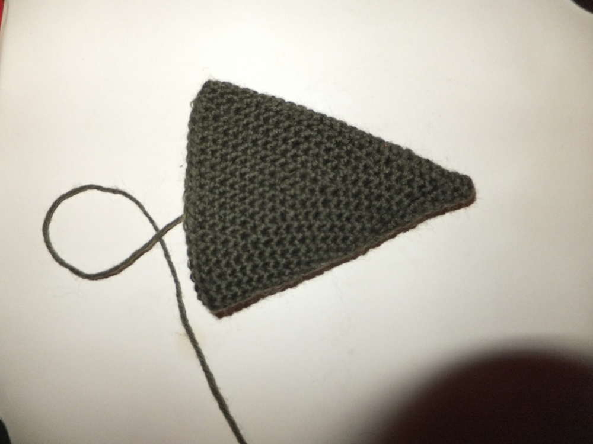
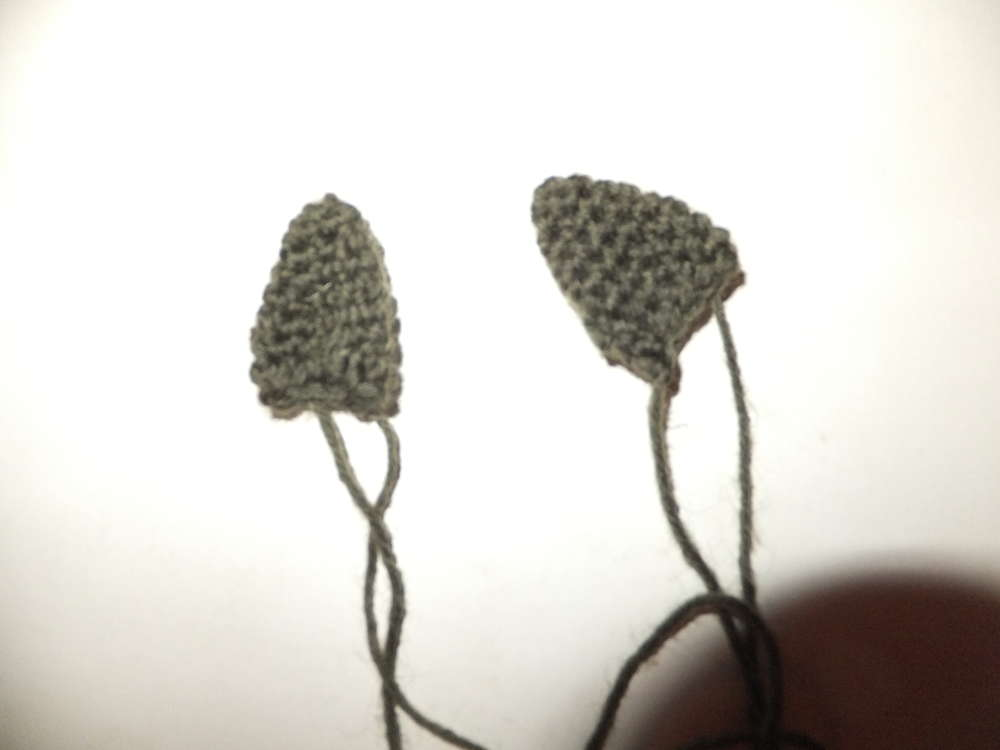

Ich habe vor langer Zeit mal eine Anleitung zum Häkeln eines Drachens
gesucht und gefunden, der Drache war mir jedoch zu klein und so habe ich
ihn vergrößert und einige Details hinzugefügt. Tatsächlich habe ich die
detaillierte Anleitung aber zunächst kein Foto gehabt. Aber den Ferien
sei Dank, ich hab mich die letzten Tage mal hingesetzt und den Drachen
erneut gehäkelt. Hier ist jetzt endlich die bebilderte Anleitung meines
Amigurumidrachens. M=Masche/n fM=feste Masche/n KM=Kettmasche
LM=Luftmasche

-   

1.  [1](#)

### Kopf {.widget-title}

​1. 2LM, in die 1.LM 6fM 2. M verd. =12M 3. Jede 2.M verd.=18M 4.-7.
18fM 8. Die ersten 5M verd., fM in restl. M =23M 9. 23fM 10. Jede 2. M
innerh. der ersten 10M verd. =27M (über der vorhergehenden Zunahme in
Reihe8) 11.-13. 27fM 14. 2M zus., 5fM, wiederh. =23M 15. 2M zus., 3fM,
wiederh. =18M, mit Watte füllen 16.-17. 2M zus., 1fM, wiederh., KM+
Faden durchz. =8M

-   

1.  [1](#)

### Körper {.widget-title}

​1. 2LM, in die 1.LM 4fM 2. M verd. =8M 3. Jede 2.M verd. =12M 4. 12fM
5. Jede 2.M verd.=18M 6.-9. 18fM 10. Jede 3.M verd. =24M 11. 24fM 12.
Jede 4.M verd. =30M 13. 30fM 14. Jede 5.M verd. =36M 15. 36fM 16. Jede
6.M verd. =42M 17.-22. 42fM 23. 2M zus., 5fM, wiederh. =36M 24. 36fM 25.
2M zus., 4fM, wiederh. =30M 26. 30fM 27. 2M zus., 3fM, wiederh. =24M 28.
24fM 29. 2M zus., 2fM, wiederh. =18M, mit Watte füllen 30. 2M zus. bis
das Loch geschl. ist, KM+ Faden durchz.

-   

1.  [1](#)

### Schwanz {.widget-title}

​1. 2LM, in die 1.LM 3fM 2. M verd. =6M 3. 6fM 4. Jede 2.M verd.=9M 5.
9fM 6. Jede 3.M verd.=12M 7. 12fM 8. Jede 4.M verd. =15M 9. 15fM …
wiederh. bis 42fM, KM+ Faden durchz.

-   

1.  [1](#)

### Augenlider {.widget-title}

2x häkeln 1. 2LM, in die 1.LM 6fM 2. M verd. bis 12M, KM

-   

1.  [1](#)

### Ohren {.widget-title}

2x häkeln 1. 2LM, in die 1.LM 4fM 2. Jede 2.M verd. =6M 3. Jede 3.M
verd. =8M 4. Jede 4.M verd. =10M 5. Jede 5.M verd. =12M 6.-8. 12fM, KM+
Faden durchz. Ohren unten zusammenraffen und vernähen

-   

1.  [1](#)

### Arme {.widget-title}

  2x häkeln 1. 2LM, in die 1.LM 4fM 2. M verd. =8M 3. Jede 2.M verd.
=12M 4.-13. 12fM, 14. KM+ Faden durchz.

-   

1.  [1](#)

### Beine {.widget-title}

2x häkeln 1. 2LM, in die 1.LM 6fM 2. M ver. =12M 3 12fM 4. Jede 3.M
verd. =16M 5.-9. 16fM 10. Jede 3.M zus. =12M 11. 12fM, KM+ Faden durchz.

-   

1.  [1](#)

### Flügel {.widget-title}

2x häkeln Stege: 16LM, 15fM, 11LM, 10fM, 11LM, 10fM, mit 16.LM des
ersten Steges verbinden. Membranen: sie bestehen aus vielen Luftmaschen,
die ein lockeres Gewebe bilden, dies ist schwer zu beschreiben. Ich habe
mit einer festen Masche in die Ecke der Membranen begonnen und immer
wechselseitig die Stege durch die Luftmaschenketten verbunden.
Gelegentlich nahm ich Maschen zu, so wird die Membran dreieckig. Denkt
euch sonst einfach etwas eigenes aus oder fragt gerne nochmal nach dann
mache ich dazu Fotos und Erklärungen.

-   

1.  [1](#)

### Stachelkamm, Nüstern, Augen {.widget-title}

Ich hab eine Reihe feste Maschen in den Rücken reingehäkelt und beim
Zurückhäkeln je Zacke 3 Luftmaschen gemacht, ein Stäbchen und eine
Kettmasche und dann wieder von vorne. Als Detail habe ich an der Nase
noch je drei Luftmaschenketten als Nüstern eingehäkelt. Zum Schluss
fehlen nur noch die Knöpfe als Augen, nehmt euch am besten Knöpfe mit
zwei Löchern und einen dunklen Faden, so hat euer Drache Schlitze als
Pupillen.

-   
-   
-   
-   
-   
-   

1.  [1](#)
2.  [2](#)
3.  [3](#)
4.  [4](#)
5.  [5](#)
6.  [6](#)

Und jetzt bin ich gespannt auf stolze Drachenmami-Fotos von euch. Hier
sind meine.
