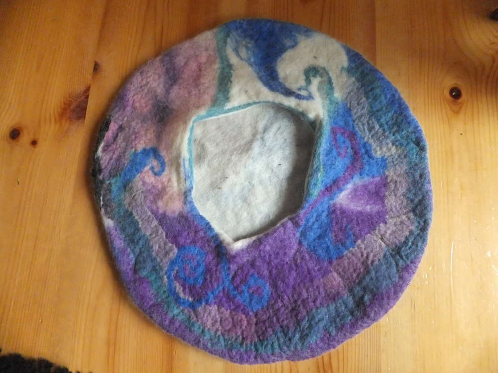
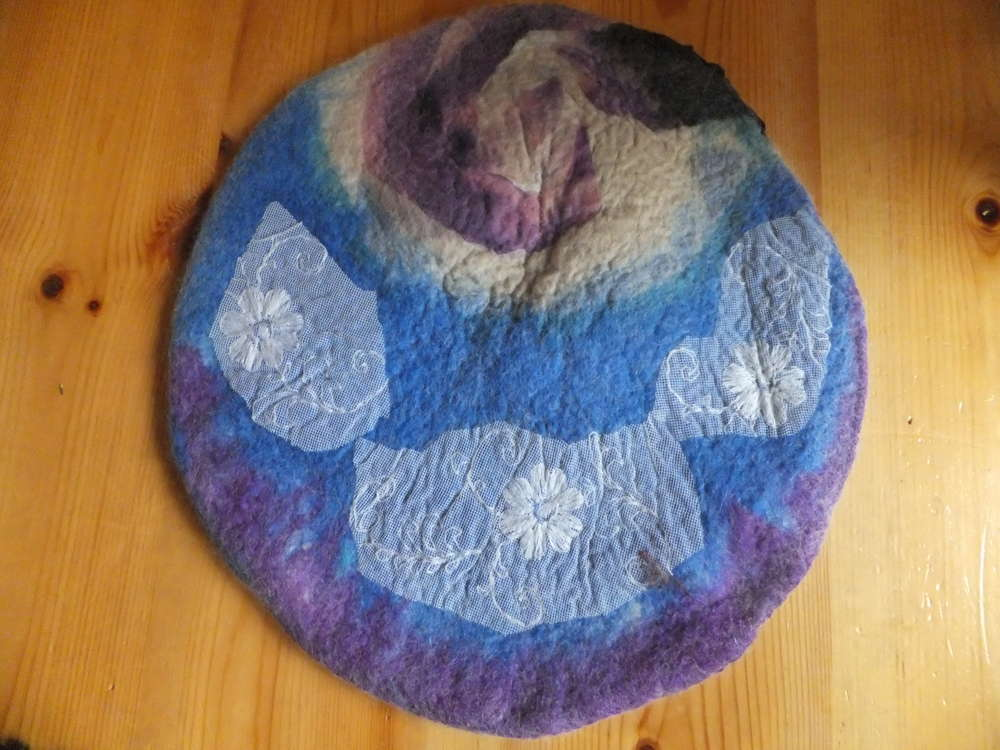
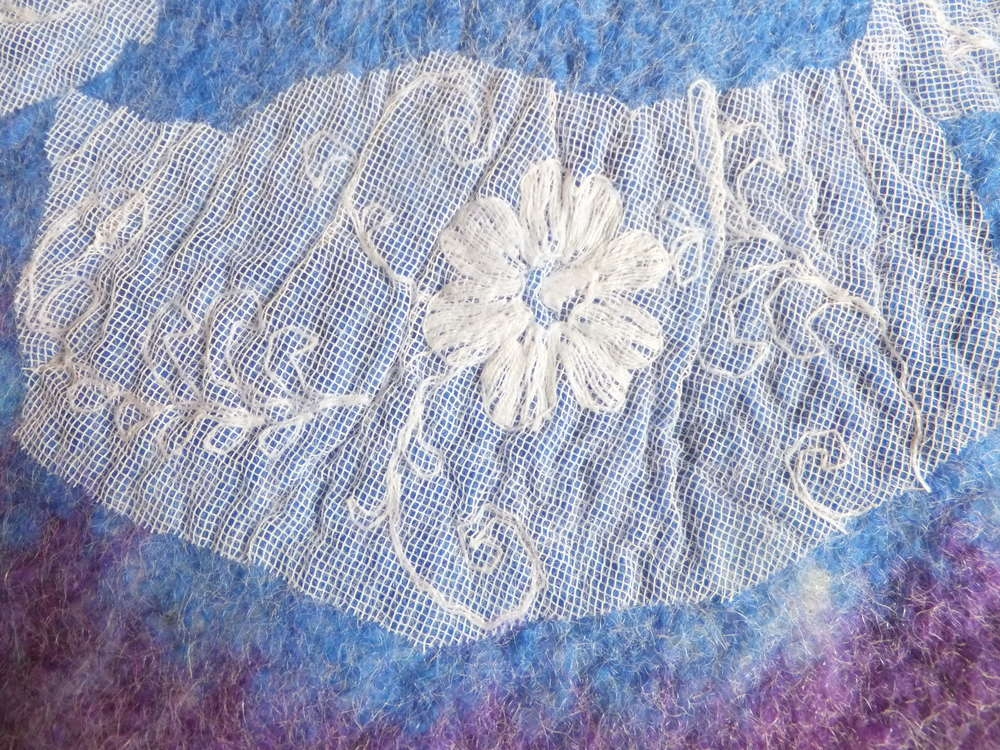
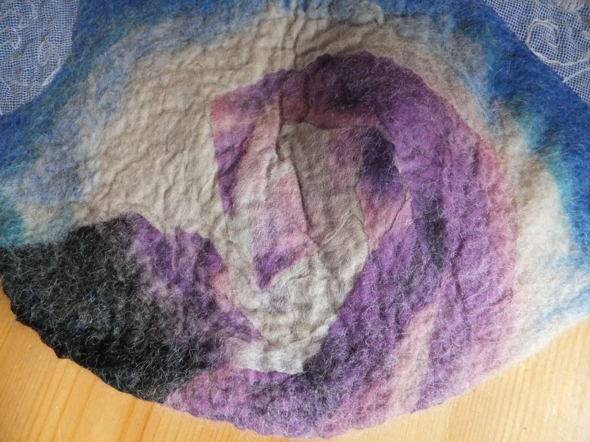
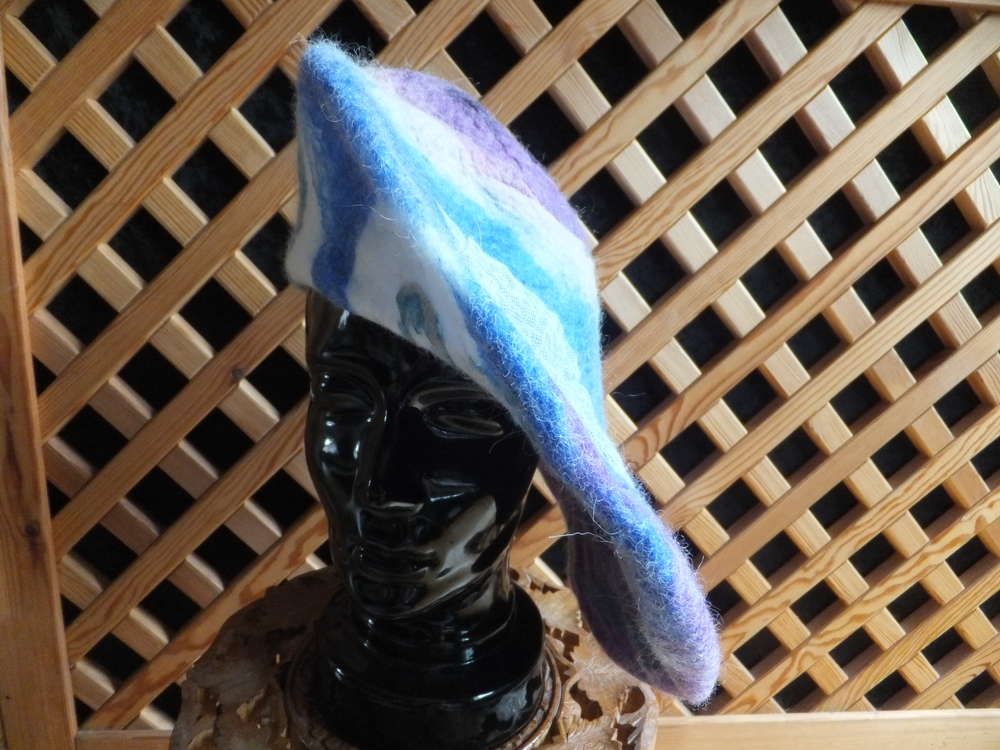
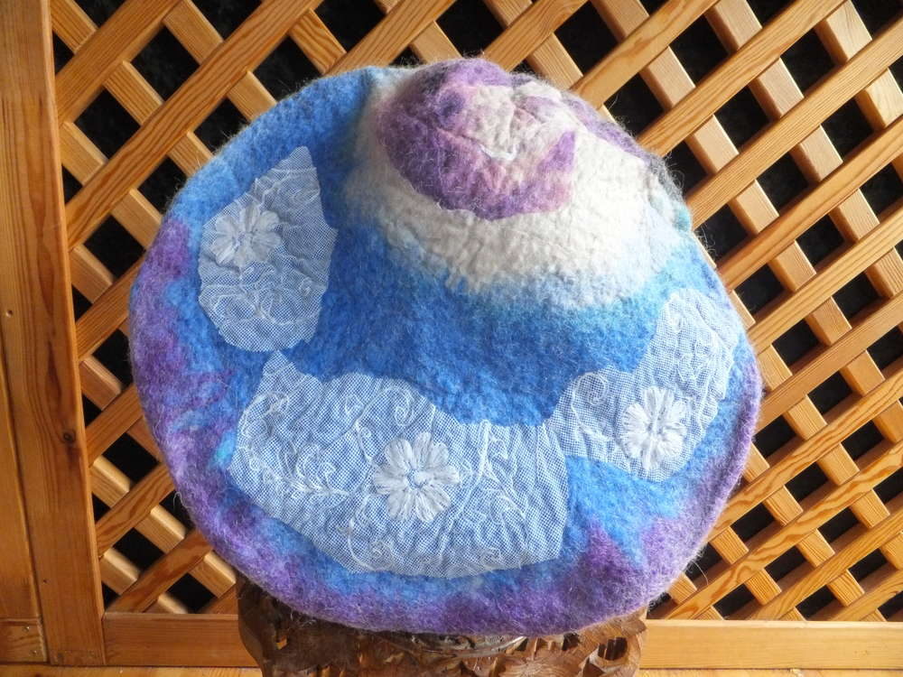
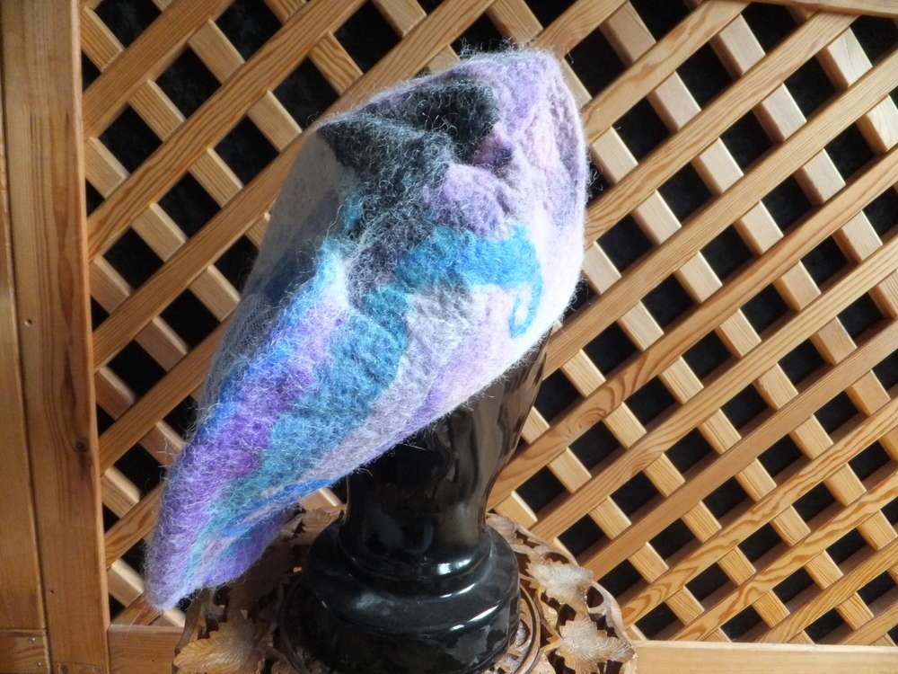
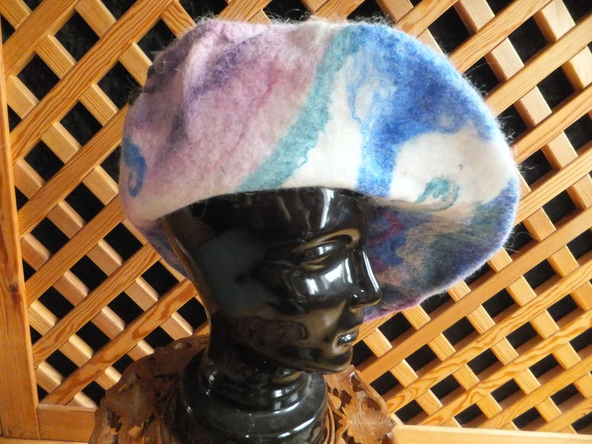

Ich brauche für meinen neuen LARP-Charakter eine neuen Hut, denn
ausnahmsweise bin ich mal keine Hexe sondern eine Wollwerkerin. Damit
nicht das Spitzhutklischee auf meinen neuen Char übertragen wird, ist es
diesmal ein Barett. Und so sieht es dann aus, wenn der Durchmesser der
Hohlform angepasst wurde und keine
[Katzenhöhle](http://flauschiversum.de/2015/07/katzenhoehle/) mehr
entstanden ist. Am gleichen Tag ist auch noch eine schlichte Tasche
entstanden aber man braucht ja auch was fürs Auge.

Das dürfte ein auffälliges Accessoire sein. Jetzt nur noch irgendwo 'ne
hübsche Brosche dran und alles tutti.

