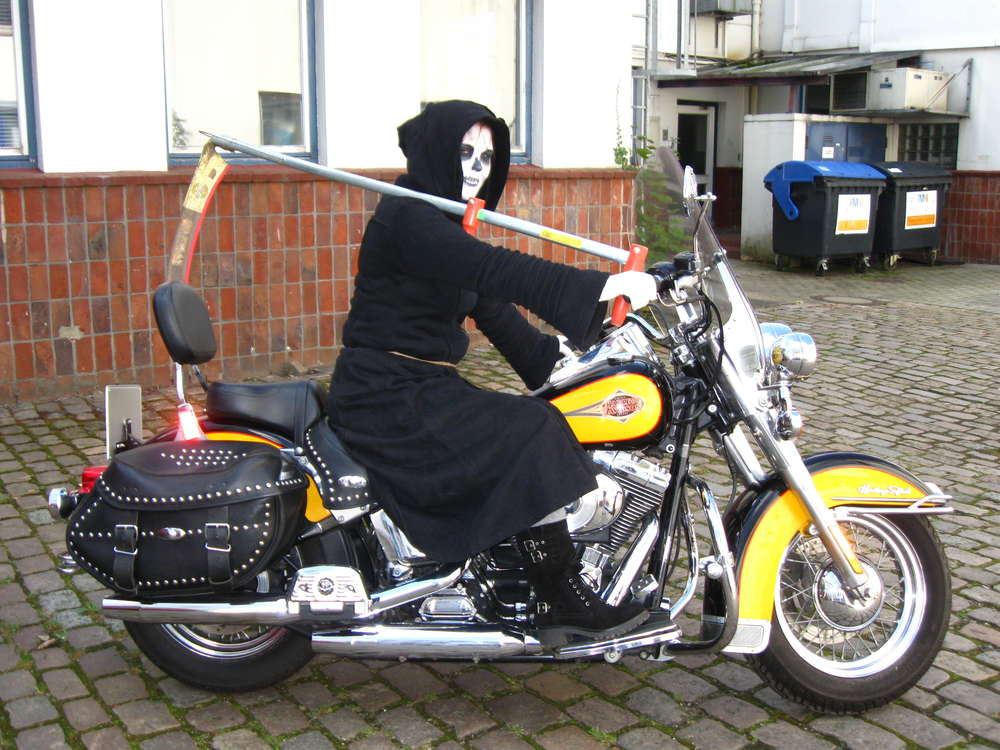
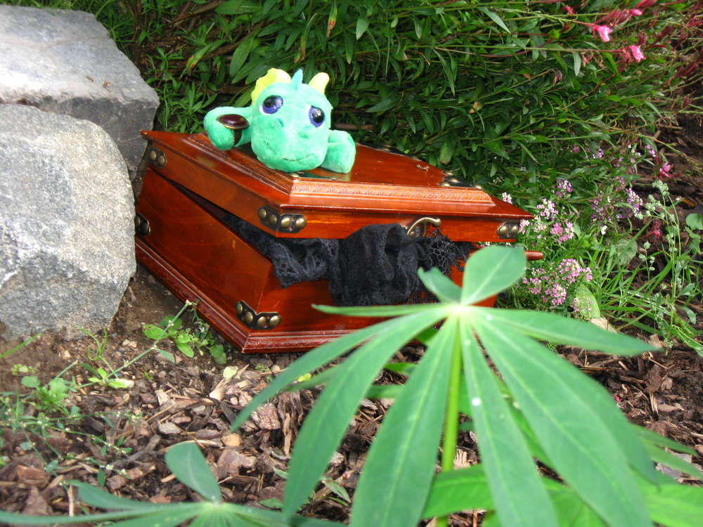

Also eine Aufgabe aus der Unterstufe der Erzieherausbildung war es ein
modernes Märchen zu schreiben und ein Märchenbuch zu gestalten. Gesagt
getan und hier ist das Gemeinschaftswerk von  einer Mitauszubildenden
und mir.

Das Cover wurde mit dem Holzbrenner in Dickleder gebrannt und mit
Lederfarben nachbearbeitet. Nach dem Brennen wurde das Leder auf den
lilafarbenen Lederumschlag genietet und dann wurde das Buch
eingeschlagen. Was man auf diesem Bild nicht sehen kann, sind die Kanten
des Buches, die mit Kupferblech eingefasst wurden und dem Ganzen den
letzten Schliff geben.

Das gebundene Werk der Kombination aus Harry-Potter-Märchen und eigenen
Stilelementen wurde geschaffen.\
 Was drinsteht ist geheim, aber es geht darum, was passiert ist, nachdem
Harry Potter die Heiligtümer nicht mehr in seinem Besitz hatte und sie
in die Hände eines armen Mädchens gelangen. Ach ja ein kleiner Drache
und der Tod daselbst, nicht zu Ross denn zu Rad, geben dem Ganzen den
Touch des ähhh Andersartigen ;) nenne ich es jetzt mal. Hier ein ein
kleiner Blick auf die Bilder im Buch.\

