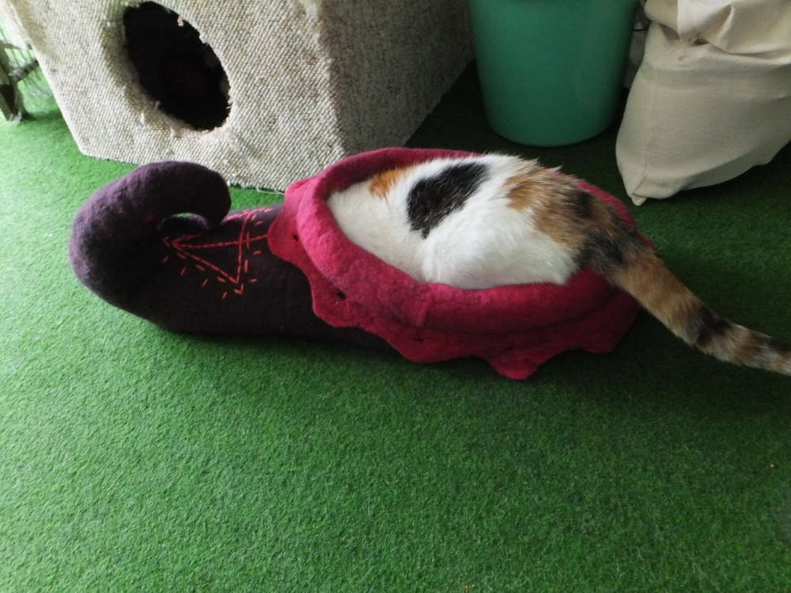

So um hier mal den Beweis zu bringen, dass ich auch noch andere Dinge
als Kopfbedeckungen filzen kann... Hoffentlich bekommt keiner Käsefüße.
Es ist ein Schuh geworden - gut, zugegebenermaßen, er ist ein wenig zu
groß geraten aber aus verlässlicher Quelle weiß ich, dass das Nathan
(oben links) und Mishou (oben rechts) nicht im geringsten stört. Dieser
Puschen besteht aus etwa 400 - 450 Gramm Merinovlies und darf nun als
Katzen-Schlafstätte dienen, hoffentlich beruhigen die beiden sich bald,
sodass ich mal ein Bild mit der eigentlichen Funktionsweise posten kann.
Manchmal wünscht man sich, dass Katzen auf einen hören würden, wenn man
sagt: "Leg dich hin." Tja und dass das Ganze nicht so richtig
funktioniert, wenn man den Puschen nicht richtig benutzt, kann man den
Beiden so oft sagen wie man will.

So und knapp eine Woche nach der Landung des Riesenpuschen, kann ich
mich selbst davon überzeugen, dass er akzeptiert wurde. Schade, dass ihr
das seelige Schnurren nicht hören könnt. Natürlich muss sich der große
Kater hineinquetschen und nicht die zierliche Katze für die der Schuh
gedacht war... aber das zeigt mal wieder die Unberechenbarkeit von
Katzen. Jetzt habe ich wenigstens einen Grund, eine weitere Katzenhöhle
zu filzen. ;)
