Ich habe mich sehr über ein Geschenk gefreut.

Lucy war kreativ, und obwohl hier gestrickt und genäht wurde, gilt dieses besondere Geschenk für mich als Bastelei. Hier hat Lucy wirklich mit Liebe bestückt und mich sehr glücklich gemacht. Und auch wenn Lucy dieses Werk vollbracht hat, so werde ich dies hier posten, damit ich auch meiner Freude freien Lauf lassen kann.

Die Vorgeschichte dazu ist jene: Lucy und ich verbrachten einen ganz normalen Sonntag miteinander und in einer Zeitschrift war dann eine kleine genähte Lunchbox abgebildet, die mich sofort begeisterte. Ich ließ nebenbei fallen, dass ich so eine kleine Box sehr gerne hätte, weil das voll toll für die Schule wäre und vergaß nach kurzer Zeit wieder, dass ich dies sagte. Nun wird nächste Woche meine Erste Klasse eingeschult und ich bekam heute mein Einschulungsgeschenk von Lucy. Schaut selbst was sie sich hat einfallen lassen.

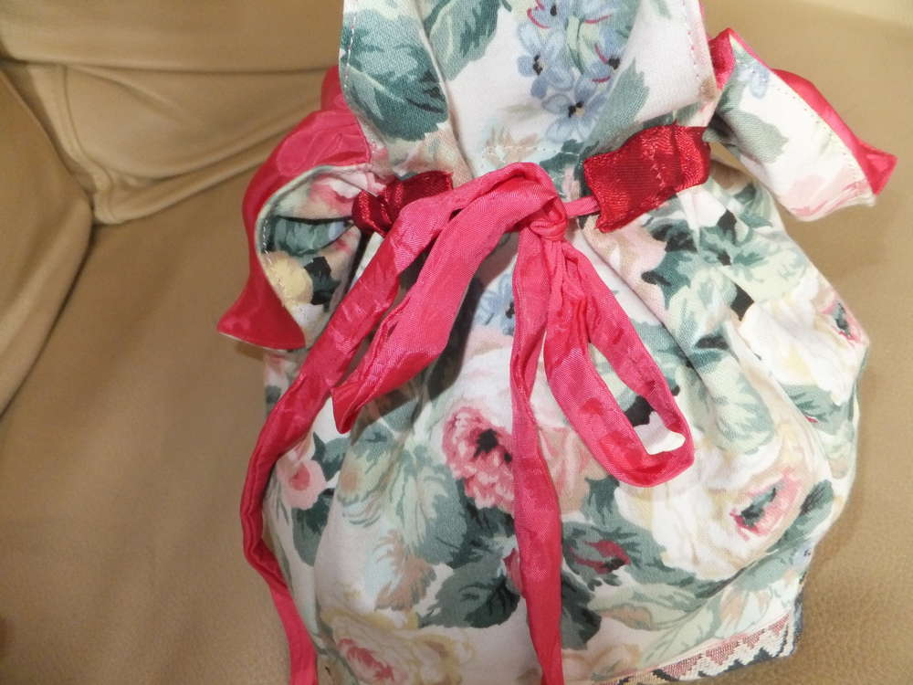
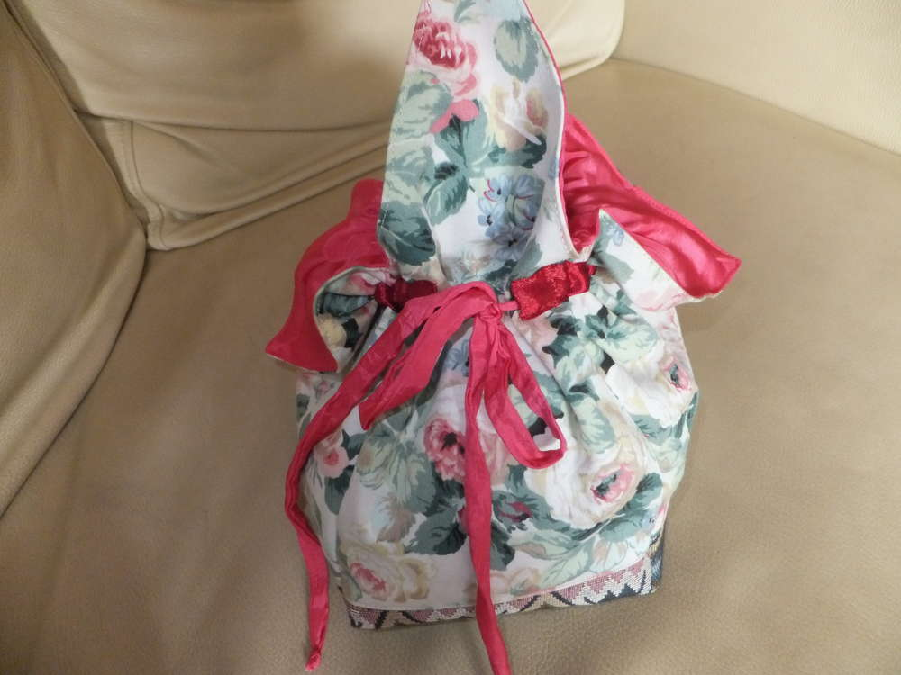
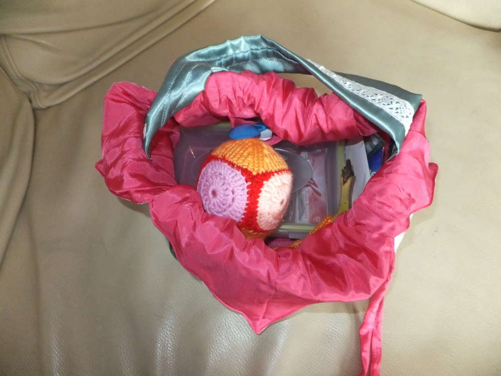
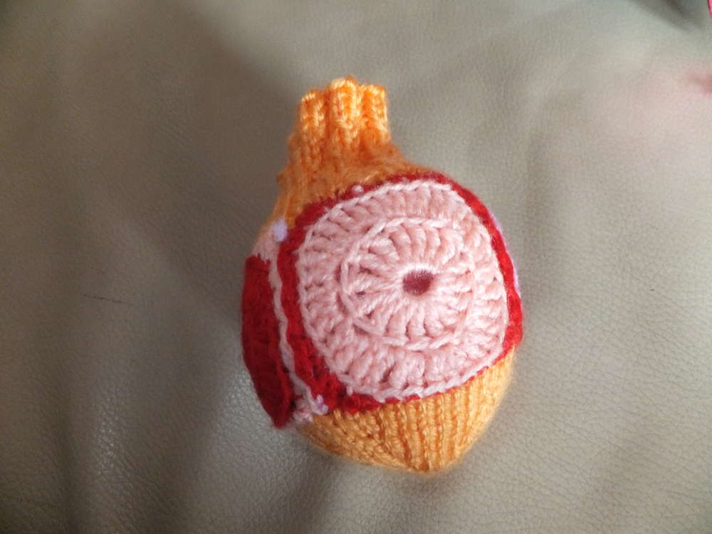
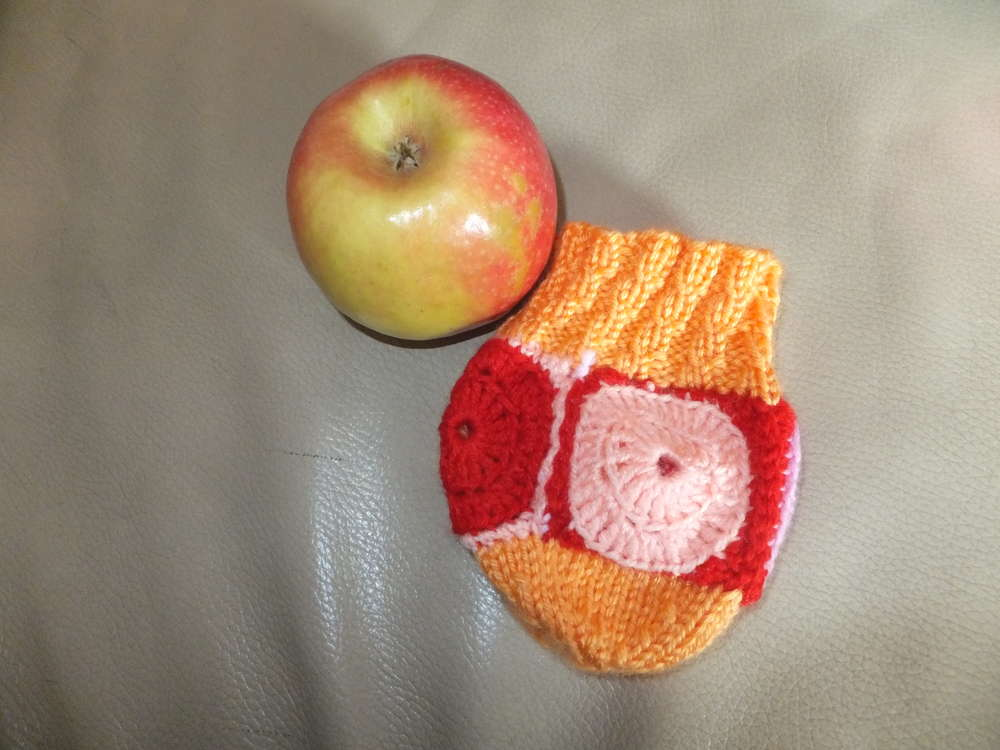
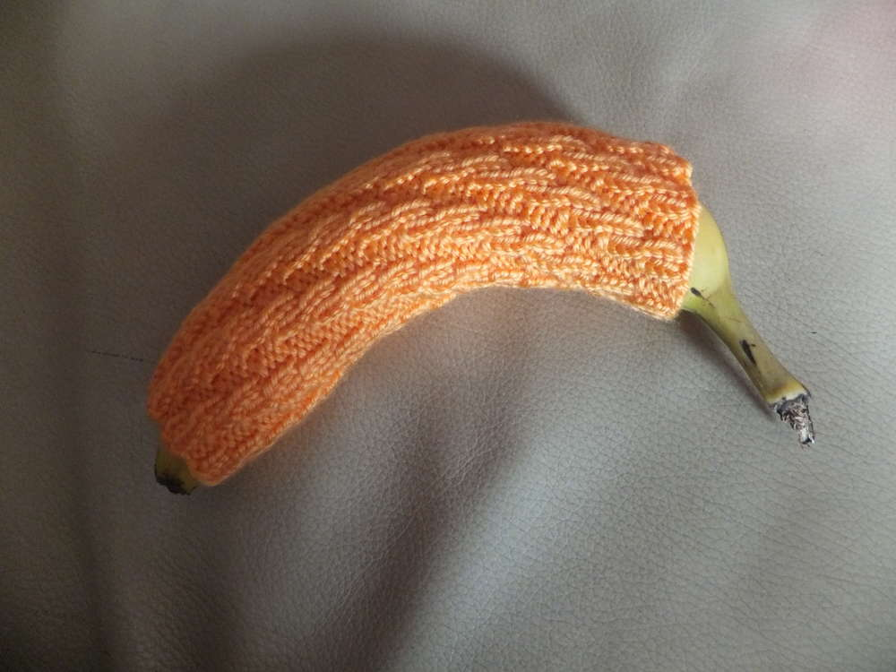
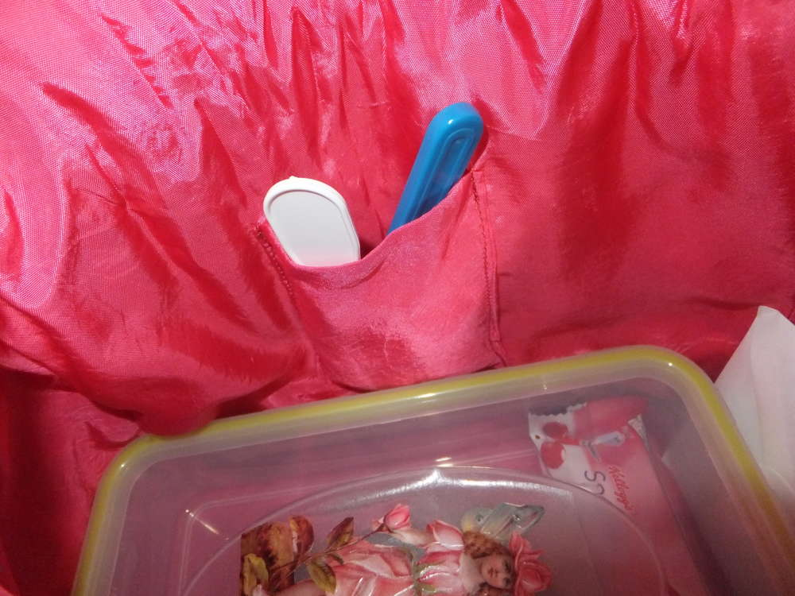
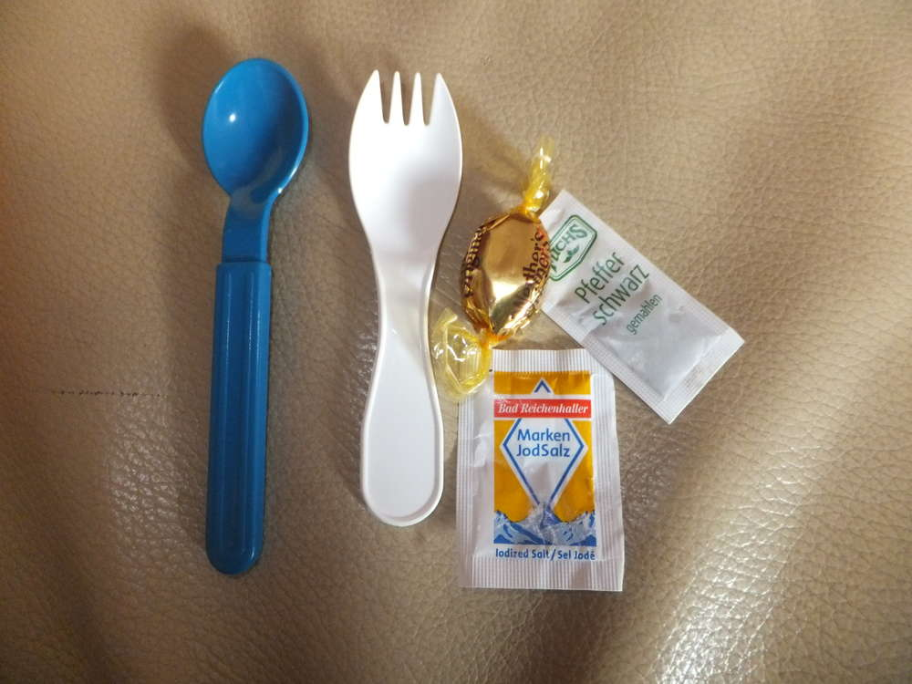
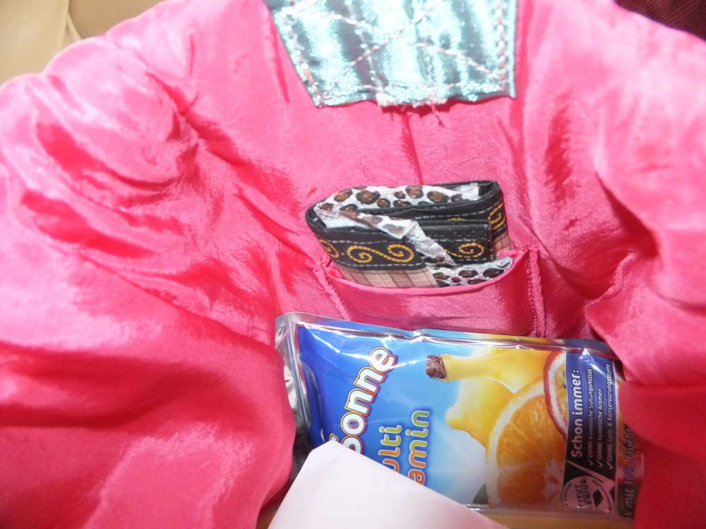
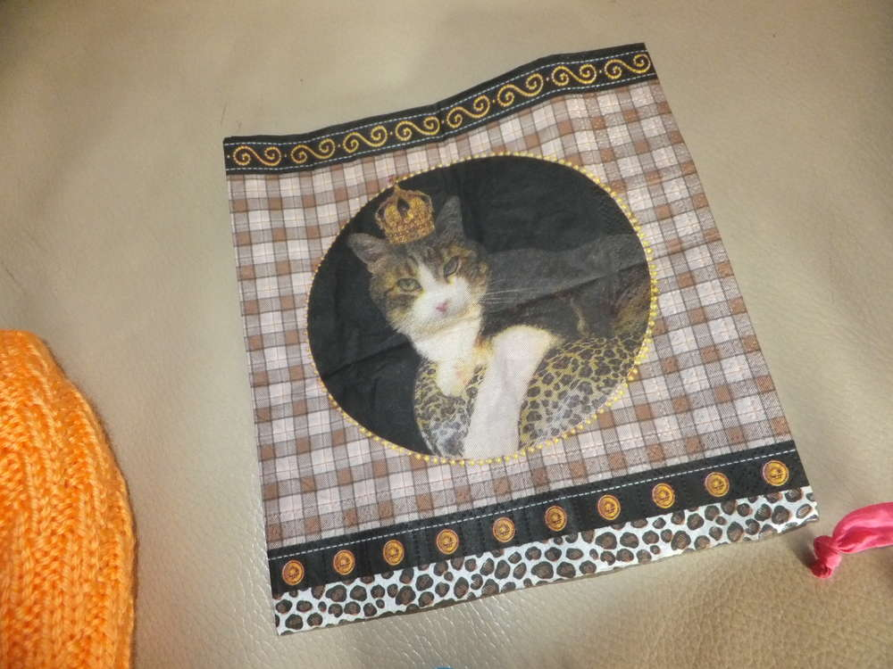
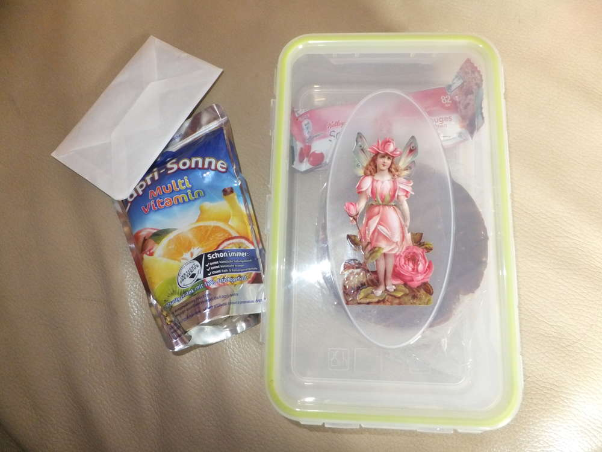
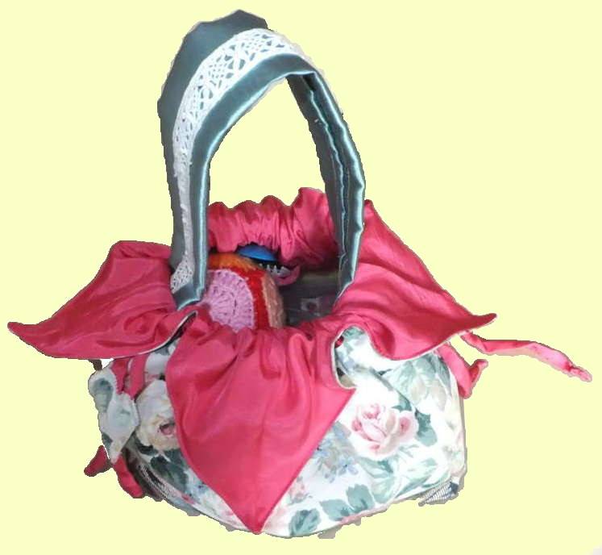

Die kleine Tasche ist mit einem dickeren Gobelinstoff als Boden genäht und hat zum verschließen eine kleine Schleife, an der ein Herzchen an der Seite hängt. die Tasche sieht ein wenig aus wie ein leicht geöffneter Blütenkelch und da harmoniert der Blütenstoff besonders gut mit dem Konzept der Lunchbox.

Werfen wir mal einen kleinen Blick in die Tasche. Neben einem Apfelpulli gegen Druckstellen und einem Bananenschutz, der auf jede Banane passt, befinden sich noch ein kleines Täschchen mit Notfallwürzung und Besteck, sowie eine Serviettenhalterung mit einer sehr passenden Katzenserviette in der Tasche. Des weiteren findet man eine Brotdose mit aufgeklebter Elfenoblate, die derzeit zwei Reiskekse und einen Müsliriegel beherbergt und eine Caprisonne, sowie einen kleinen Gruß mittels Kärtchen. Jetzt kann ich mich auf den Snack zwischendurch freuen und es passt sogar meine kleine Thermoskanne für den Wintertee hinein.
