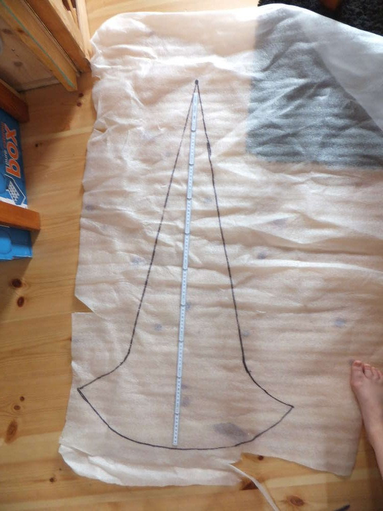
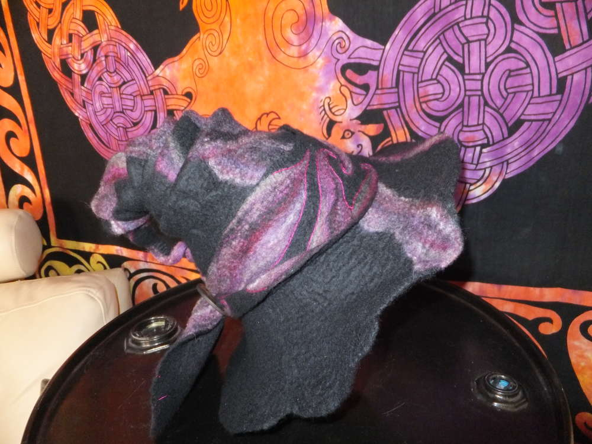
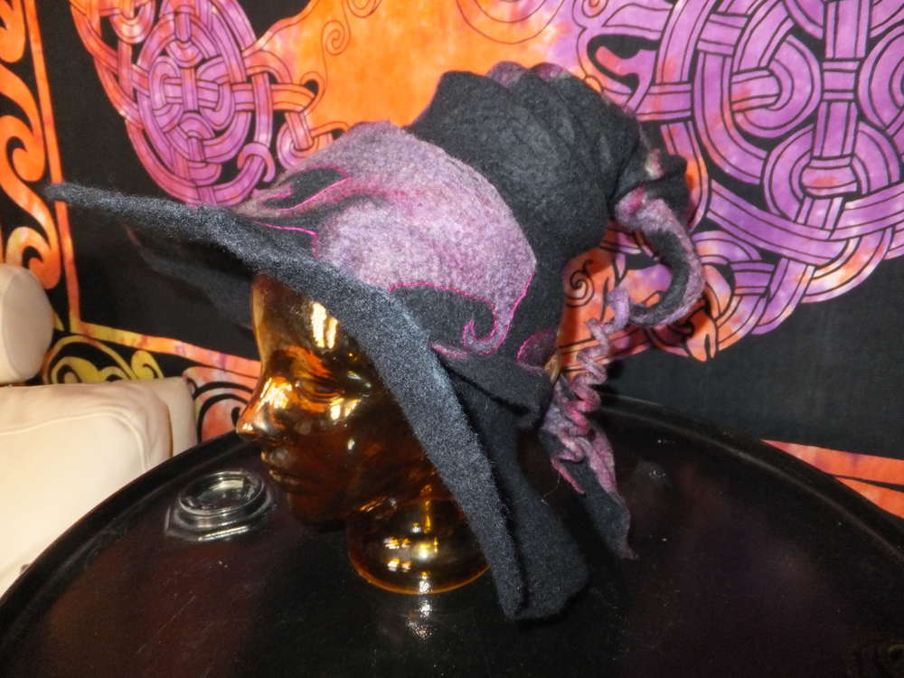
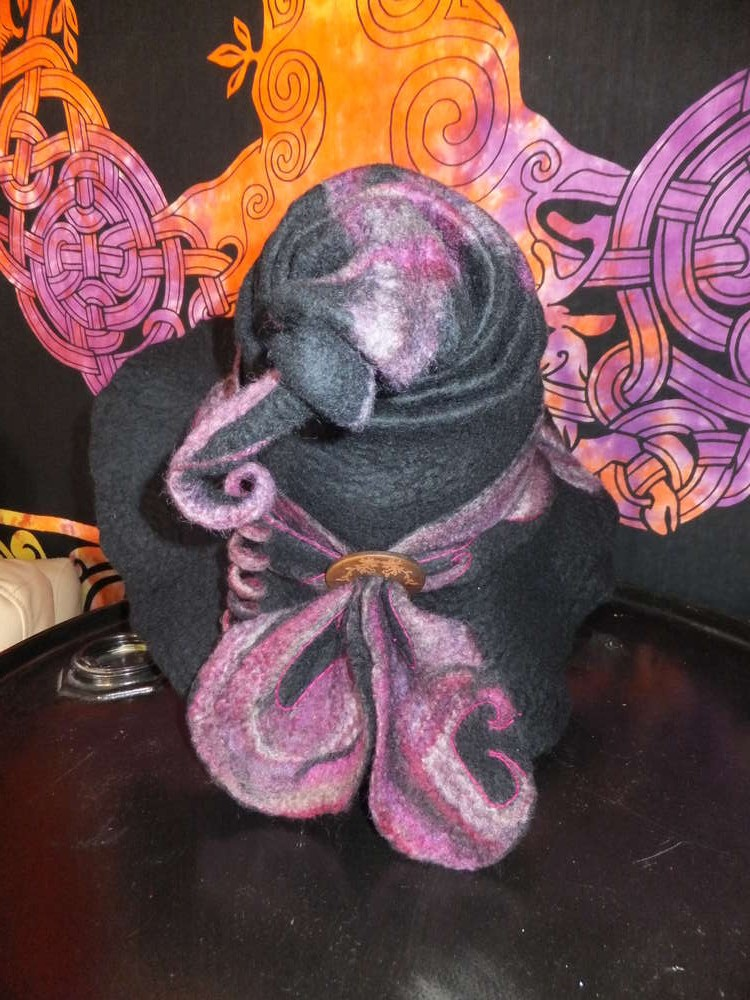
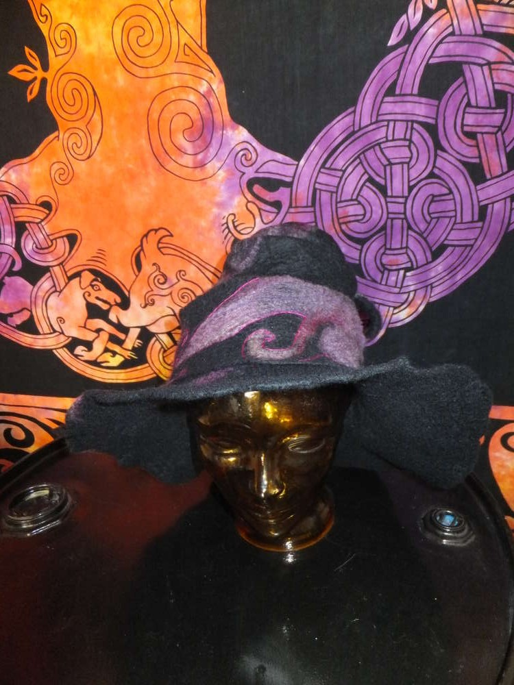

Und meine Freude ist riiiiiesig. Endlich darf auch Ermeline mit einem
schönen Merinoflausch-Hut herumlaufen und nicht mehr mit dem
improvisierten Erstlingsunfall aus der Waschmaschine.

Damit die Zoeharmonika geformt werden konnte musste ich meine übliche
Form auf einen Meter verlängern.  

Das Hutband habe ich noch nachgestickt, damit die Formen noch deutlicher
herauskommen und ich lieeeebe diesen lustigen Zwirbel an der Spitze,
dafür muss man nur das Band um einen Bleistift wickeln, ein wenig walken
und so trocknen lassen.  

