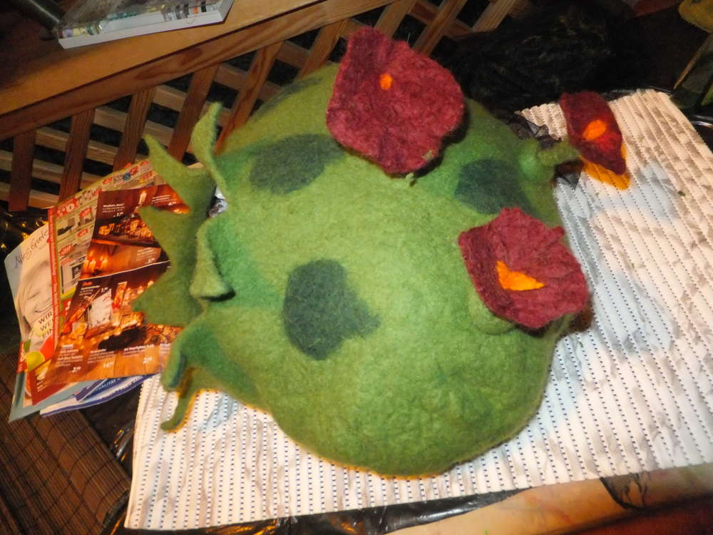
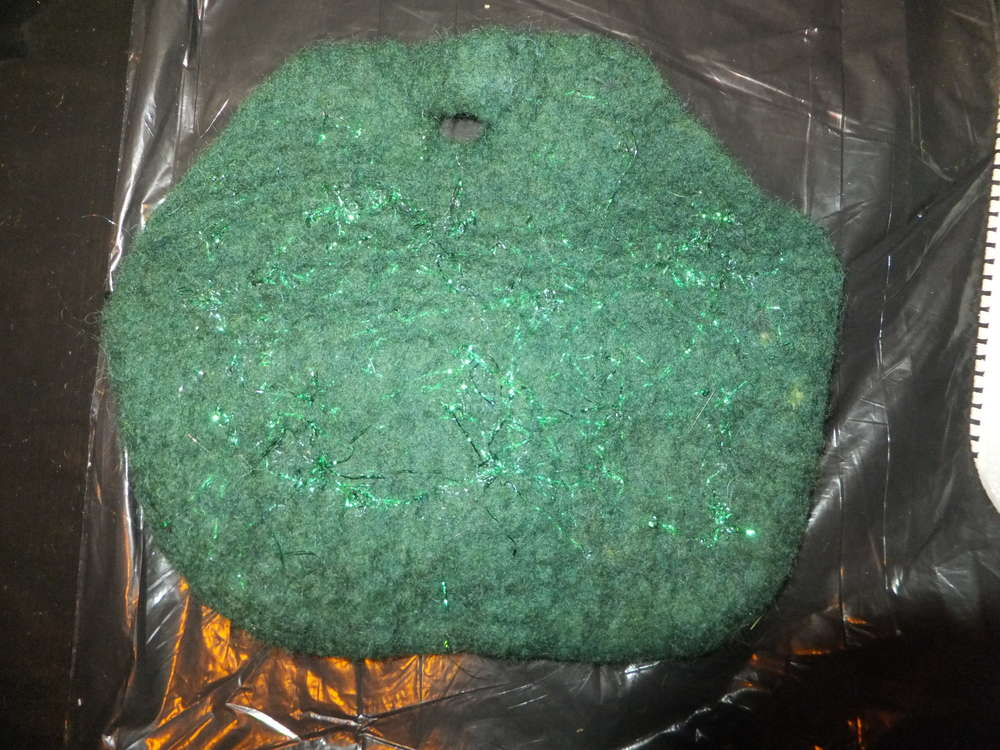

Einmal ne Frage in die Runde gestellt wer gerne mal mit mir filzen möchte und haufenweise Zusagen. Ich habe kürzlich mit ein paar Freunden bei mir gefilzt und bis auf eine Handpuppe, die ebenfalls entstanden ist (die ich aber verpeilt habe zu fotografieren) sind dies die Ergebnisse.

eine fröhlich grüne Katzenhöhle mit Blümchen für eine Katze vom Format "explodiertes Sofakissen"

ein Portemonnaie für Discoabende, (ich wusste, dass meine Eulenknöpfe mal einer würdigen Aufgabe zugeführt werden)

eine Regenbogentasche, die einfach nur eine Regenbogentasche sein soll und keine Statementtasche. ;)

An dieser Stelle will ich auch noch die Handpuppe würdigen, die ich leider aufgrund des vorzeitigen Aufbruchs der Filzerin nicht mehr abgelichtet habe, als Vorlage diente uns meine [Susette](http://flauschiversum.de/2015/07/filzen-filzen-filzen/) mit der persönlichen Abwandlung zu einer Drachenhandpuppe. Entstanden ist sie aus einer Mischung von Nass- und Trockenfilzen, ich würde mich sehr über ein Foto freuen, sollte ich noch eins zugeschickt bekommen, werde ich es anfügen.

