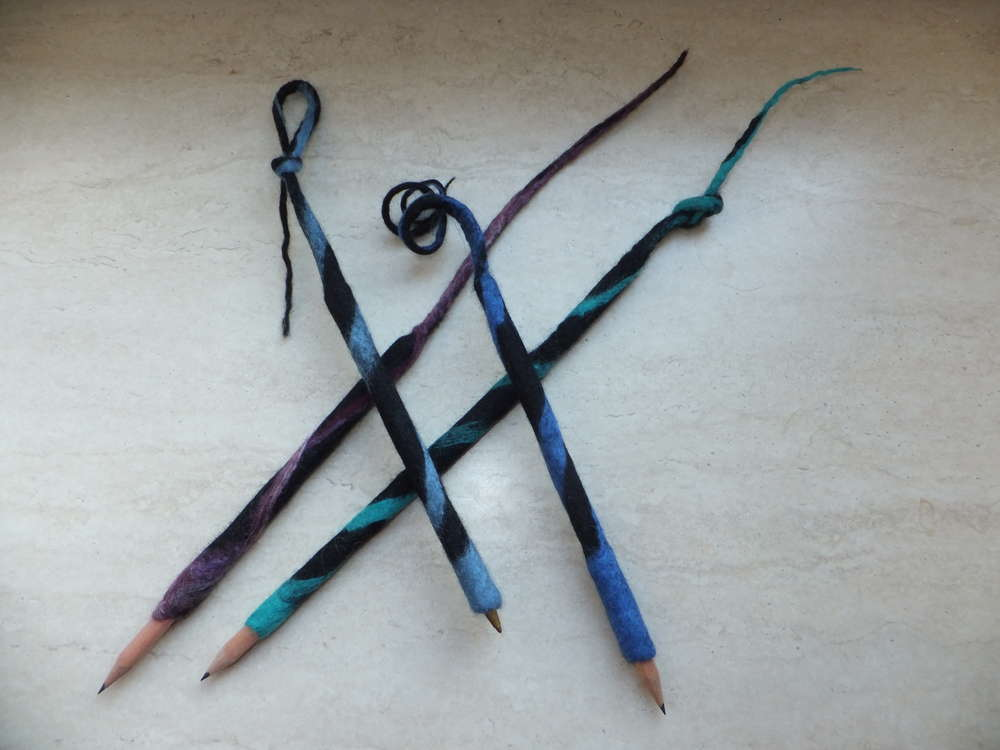

-   

1.  [1](#)

Diese Stifte gehen ganz schnell und man kann ganz toll seine Reste
verwerten... man muss nur etwas Filzwolle um einen dicken Stift wickeln
und mit Seifenwasser nass machen, dann rollen und wenn alles angefilzt
ist den dicken Stift gegen den endgültigen Stift ersetzen und solange
walken bis das Mäntelchen passt. Macht richtig Spaß, versucht es selber
mal, das ist definitiv was für Einsteiger und verspricht einen schnellen
Erfolg. Und es sieht toll aus, fühlt sich noch besser an beim Schreiben
und man kann sich die Stifte irgendwo dran festbinden, damit sie nicht
verloren gehen. Und nicht zu vergessen den Nebeneffekt, dass sie auch
als Katzenspielzeug geeignet sind.
