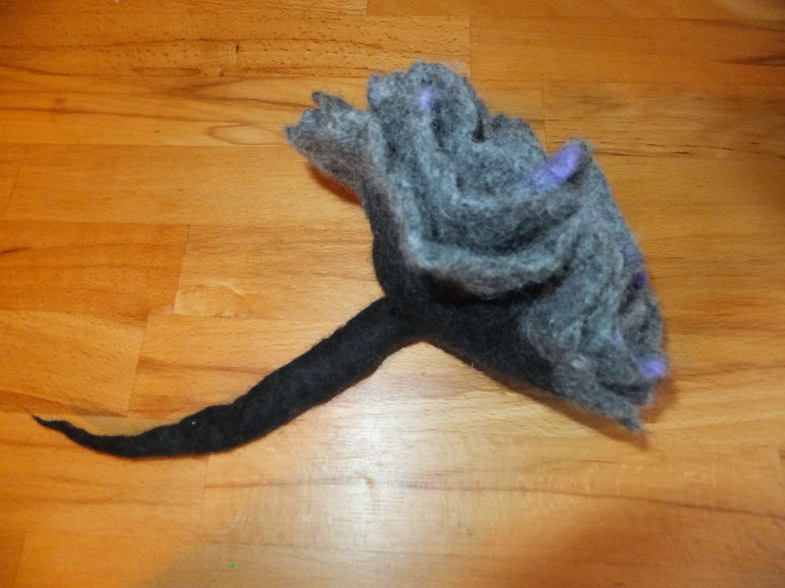
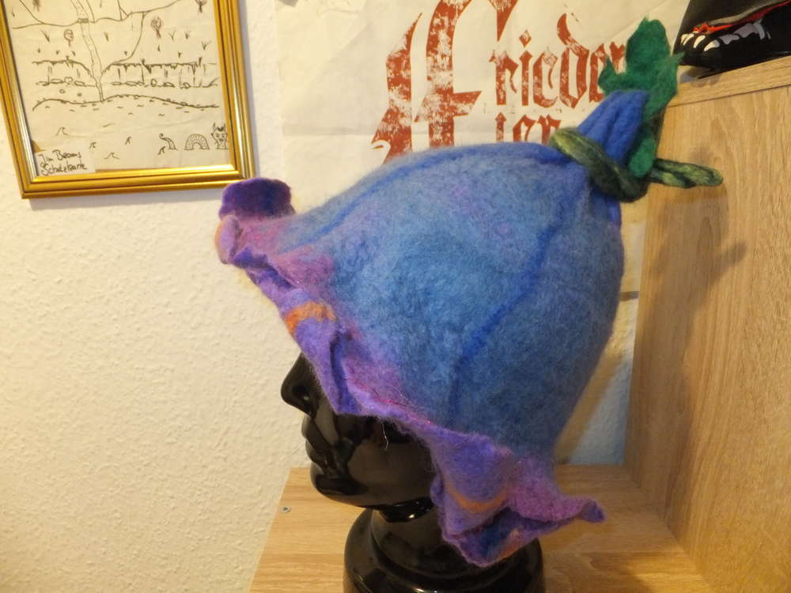
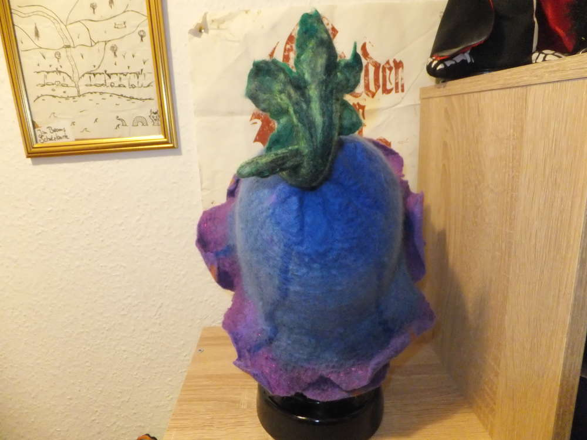
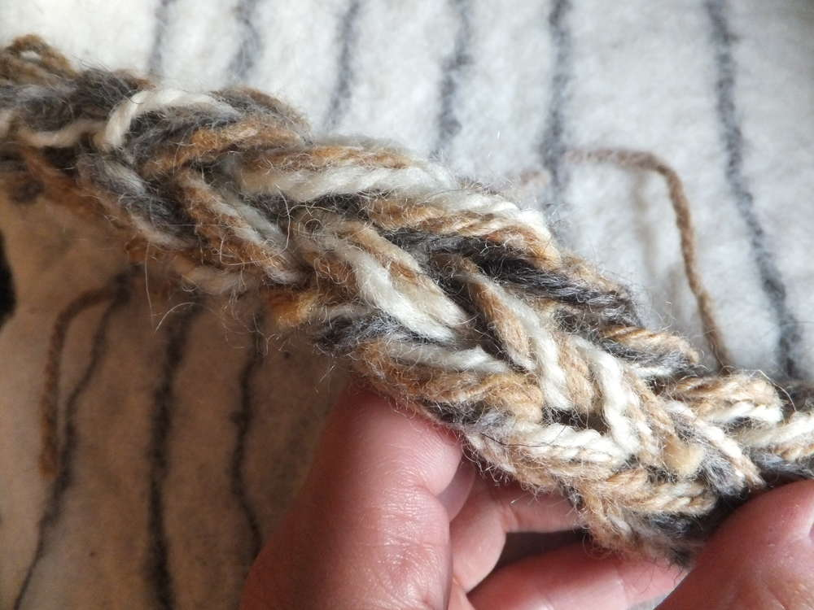

Einige Tage des Filz-Kreativismus liegen hinter mir. Meine Hände sind
schrumplig, der Wollvorrat hat sich stark reduziert und ich bin über die
Ergebnisse glücklich. Endlich hat sich auch mal eine gemeinsame
Filzsession mit Lucy ergeben, die mit der genialen Idee eine Seerose
filzen zu wollen ein Lauffeuer entfacht hat. Entstanden innerhalb der
letzten sieben Tage sind:

-   
-   
-   
-   
-   

1.  [1](#)
2.  [2](#)
3.  [3](#)
4.  [4](#)
5.  [5](#)

eine Handpuppe Namens "Susette" (die nicht anders aussehen könnte als
sie es sollte - ein rosa Einhorn kommt selbst mit viel Phantasie nicht
hin, da hat einiges spontan nicht gepasst.)

-   
-   
-   
-   

1.  [1](#)
2.  [2](#)
3.  [3](#)
4.  [4](#)

-   
-   
-   
-   
-   

1.  [1](#)
2.  [2](#)
3.  [3](#)
4.  [4](#)
5.  [5](#)

zwei Seerosen mit Blatt (rechts von Lucy; links von mir) zwei Sitzkissen
(die trotz der ähnlichen Materialien kaum verschiedener sein könnten)
hier ist das Kissen von Lucy

-   
-   
-   
-   

1.  [1](#)
2.  [2](#)
3.  [3](#)
4.  [4](#)

hier mein Kissen, mal wieder ein
[Schleimmonster](http://flauschiversum.de/2015/02/kuschelmonster/).

-   
-   
-   

1.  [1](#)
2.  [2](#)
3.  [3](#)

-   
-   
-   

1.  [1](#)
2.  [2](#)
3.  [3](#)

drei kleine Blumen zwei große Rosen

-   
-   
-   
-   
-   
-   

1.  [1](#)
2.  [2](#)
3.  [3](#)
4.  [4](#)
5.  [5](#)
6.  [6](#)

-   
-   
-   
-   
-   

1.  [1](#)
2.  [2](#)
3.  [3](#)
4.  [4](#)
5.  [5](#)

ein Blumenhut ein Paar Stulpen

-   
-   

1.  [1](#)
2.  [2](#)

-   
-   
-   
-   
-   

1.  [1](#)
2.  [2](#)
3.  [3](#)
4.  [4](#)
5.  [5](#)

eine Tasche Ich bin selber total geplättet, was alles so im Filzrausch
entsteht. Und ich bin noch nicht mal fertig mit der Filzaktion, mir
schweben noch allerhand Dinge im Kopf herum und zum Glück sind ja jetzt
Ferien. Habe dennoch den Tapeziertisch aus dem kleinen Wohnzimmer
abgebaut und werde nun auf kleinere Projekte umsteigen bzw. ein großes
wird es hoffentlich in den Ferien noch geben, wenn gutes Wetter ist. Ich
sag mal soviel, es soll was zum Anziehen sein und es wird so viel Platz
beim Filzen beanspruchen, dass ich dafür auf den Hinterhof ausweichen
muss. Für heute wird erst mal gestrickt und mal schauen was der
Zauberkasten heute so zeigt.
