Es war einmal... ... ein Freund (siehe links) und der wollte (wie könnte
es anders sein...) einen Hut. Und wie man den Hut macht, kann im
Folgenden begutachtet werden.  

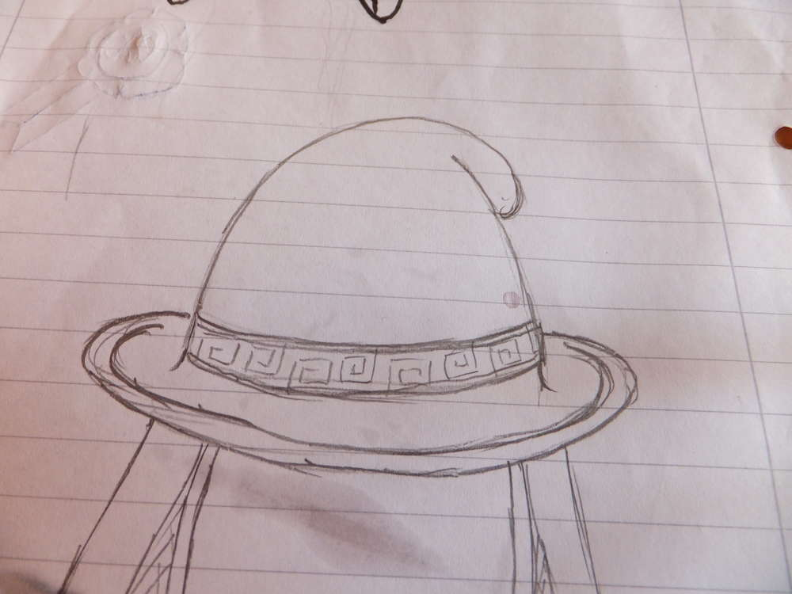
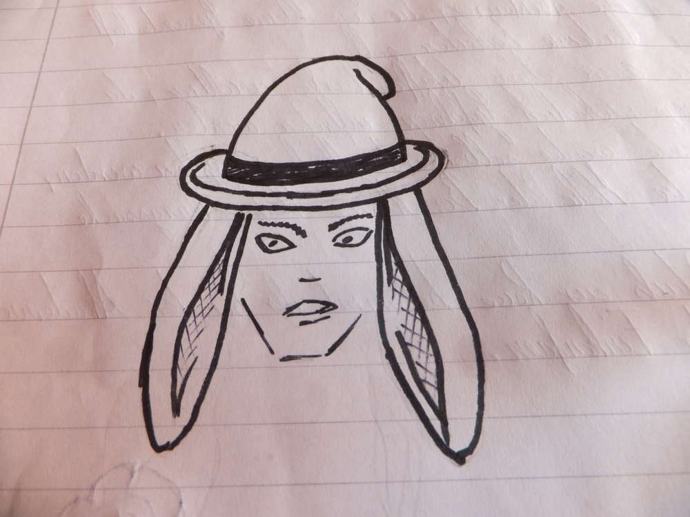
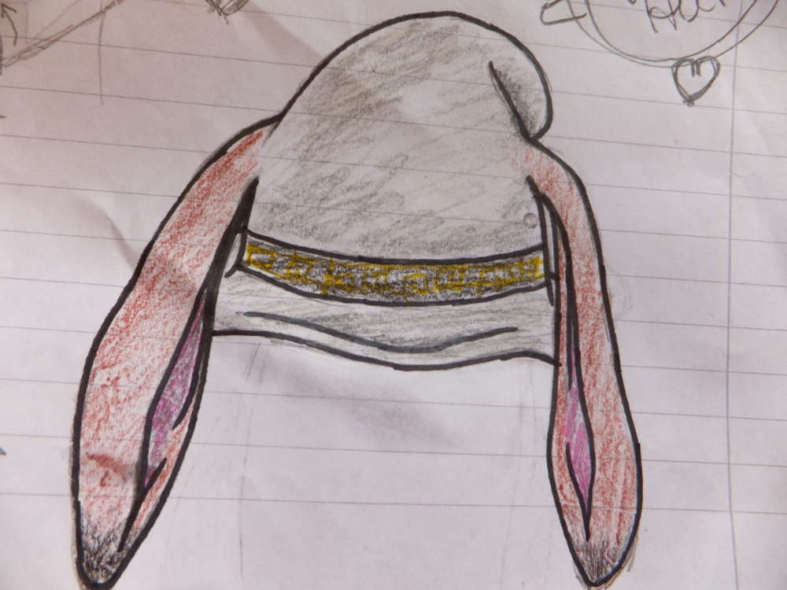
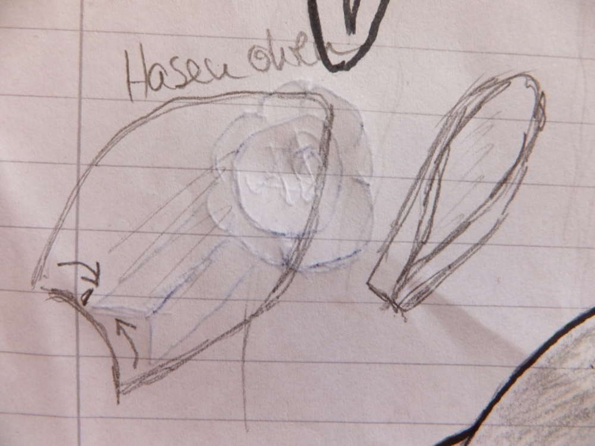

Diesmal habe ich mich zusammengerissen und von Anfang bis Ende mit Fotos
dokumentiert, stell dich also auf einen längeren Beitrag ein.

Man braucht ganz klar eine Idee bevor man starten kann, glücklicherweise
kam ein Freund mit dieser grandiosen Idee genau zum richtigen Zeitpunkt.
Also habe ich mir Gedanken gemacht und ein paar Skizzen angefertigt,
unter Zuhilfenahme meiner Filz und Nähbücher, denn Hasenohren wollen
schließlich die richtige Form haben. Tja und dann ab zum Wolldealer des
Vertrauens...

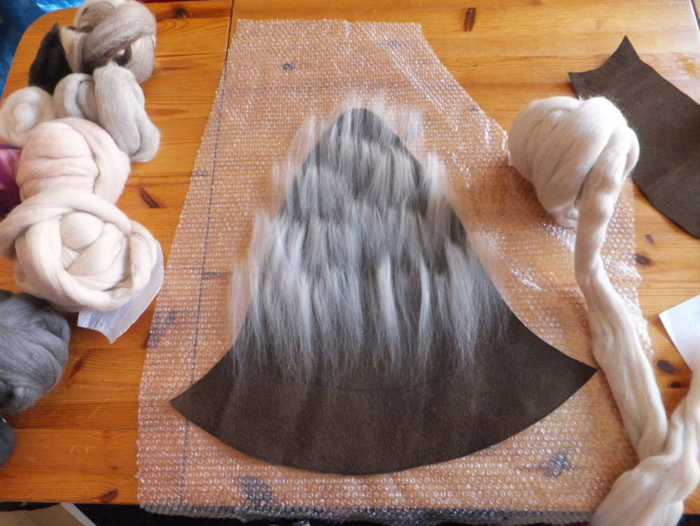
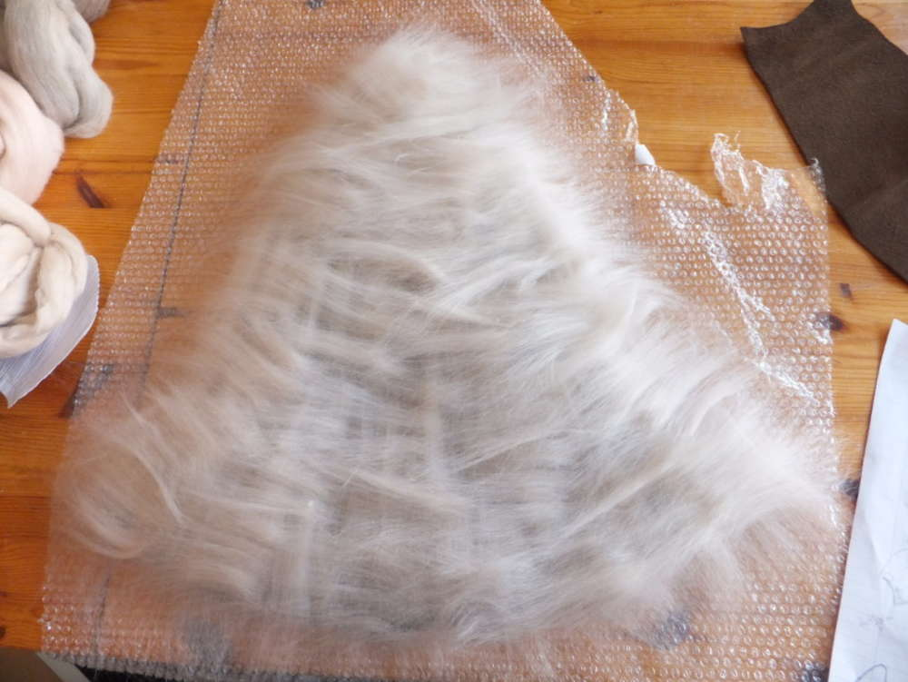
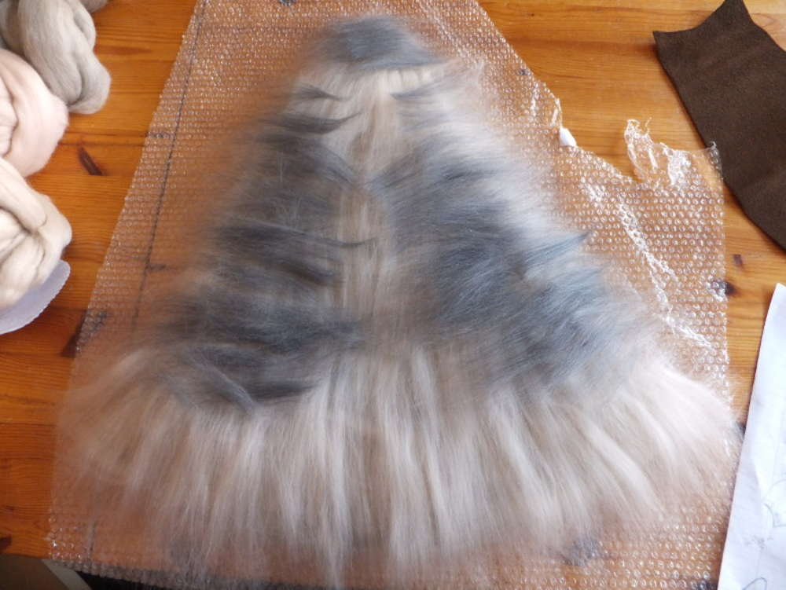
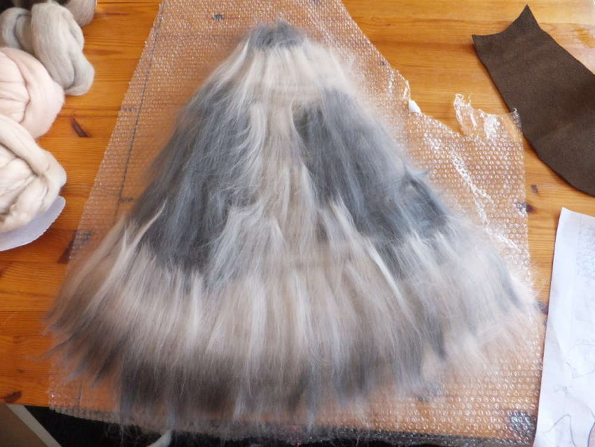

Als besagter Freund das Konzept abgenommen hatte, habe ich für den Hut
eine Hohlform angefertigt um die der Hut gefilzt wird. Danach wird die
Wolle ausgelegt, jeweils abwechselnd waagerecht und senkrecht. Insgesamt
habe ich 9 Schichten gelegt.

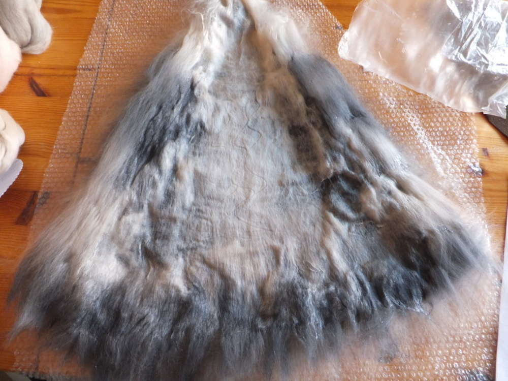

Los gehts, die erste Seite wird mit Seifenwasser nass gemacht und mit
vorsichtigem Reiben angefilzt. Ich nehme eine Brottüte zum Anfilzen,
denn da kleben die Wollfasern nicht so leicht wie an den Händen. Aus
einer leeren PET-Flasche mit großem Deckel habe ich mir eine
Sprühflasche gemacht, mit der ich das Seifenwasser auf das zu filzende
Stück sprühe. Achtet beim Anfilzen der ersten Seite darauf, dass die
Ränder einigermaßen trocken bleiben, denn die brauchst du noch zum
Verbinden mit der anderen Seite.

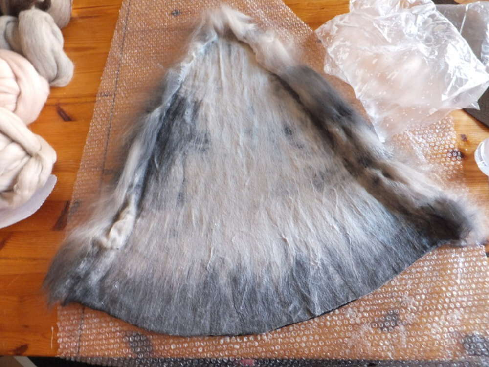

Und nachdem wir vorsichtig angefilzt haben und alles mit dem Wasser
getränkt ist kann ich anfangen mit den bloßen Händen zu arbeiten. Die
Arbeit wird zusehends glatter und es bildet sich ein Gewebe. Bevor die
Hutkrempe zu sehr verfilzt, habe ich sie umgeschlagen, denn so verfilzt
sie mit dem Inneren des Hutes und man bekommt eine saubere Kante.  

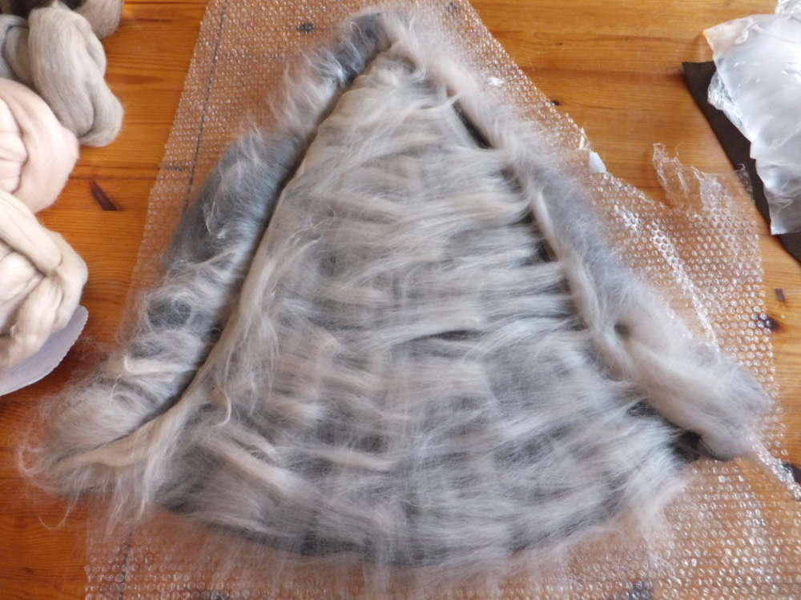

Schreibt euch auf einem Zettel am besten auf wie ihr die Schichten
gelegt habt, wenn ihr, so wie ich in diesem Falle, mehrere Farben
verwendet. Ich lege nun wieder die Schichten abwechselnd waage- und
senkrecht.

Ich klappe ca. alle 2 Schichten die Ränder vom zuerst gefilzten Stück
um.

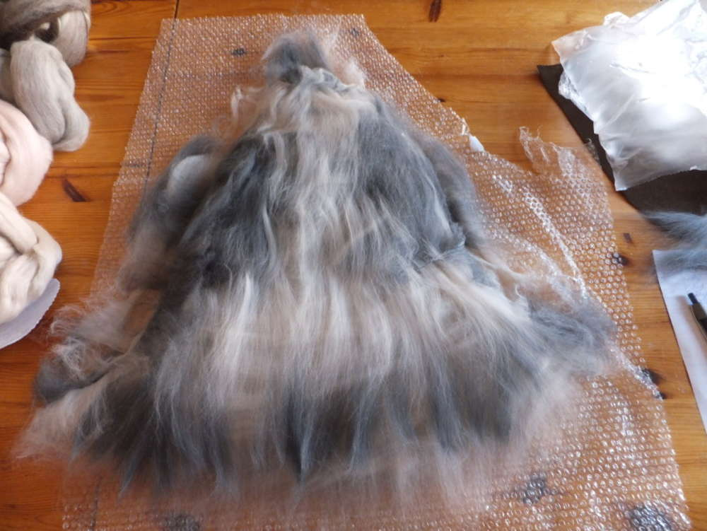
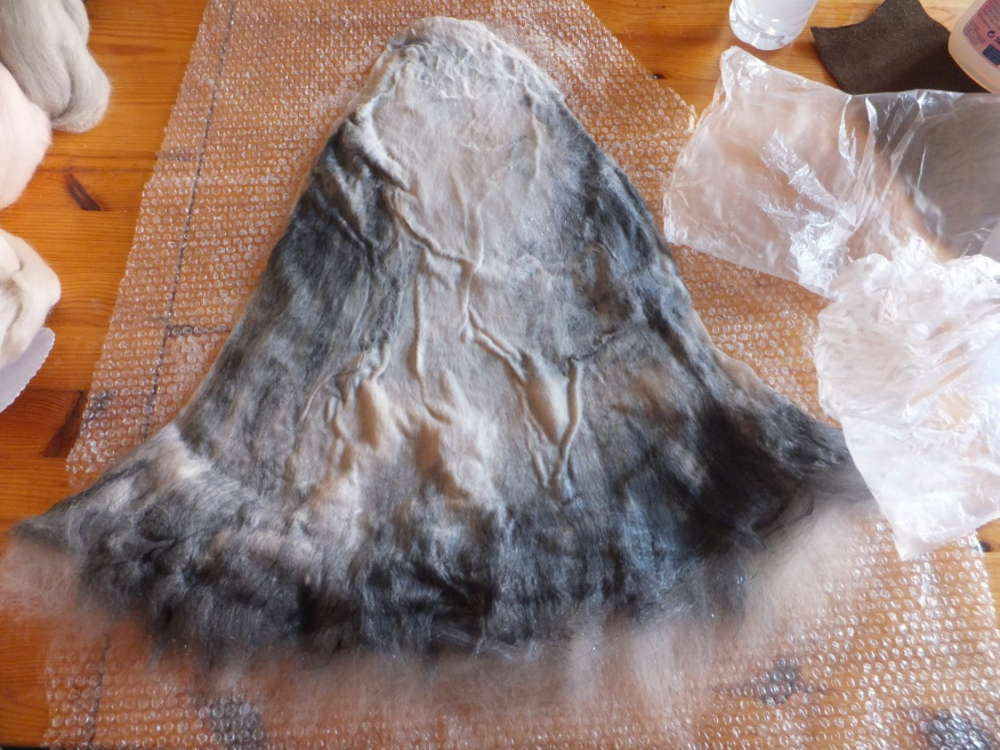

Auf diese Weise verfilzen die Ränder zuverlässig durch mehrere Schichten
miteinander und es gibt keine Löcher. Bis die letzte Schicht gelegt ist
verfahre ich so und dann geht die Planscherei wieder los... einmal nass
machen bitte!

Jetzt gut aufpassen, die Ränder müssen gut verfilzt werden, dafür mit
leichten reibenden Bewegungen die Kante zur Innenseite der Filzarbeit
reiben. Sobald die Kanten dann angefilzt sind, kann man wieder
großflächig reiben und streicheln. Dann wieder die Hutkrempe umklappen
und los geht das Reiben, man kann zusehends grober arbeiten, man merkt,
dass die Wolle sich nicht mehr verschiebt. Gelegentlich kann man einmal
vorsichtig an der Oberfläche zupfen, wenn sich noch Fasern herauslösen
muss noch weitergerieben werden. Ist die Oberfläche gut verfilzt, sodass
sich keine Fasern mehr bei der Zupfprobe lösen, kann die Hohlform
herausgenommen werden und der Hut an den Kanten an denen die Vorder- und
Rückseite zusammengefügt wurde geglättet werden.

Wenn du einen einfachen Hut möchtest musst du an dieser Stelle das
Walken beginnen um deinem Hut Stabilität zu verleihen.

Willst du einen Hut wie den hier, dann wird er so wie er ist, erst mal
zur Seite gelegt. Denn wir erinnern uns an das Foto von oben... da sind
Ohren dran!! Also zu den Ohren.

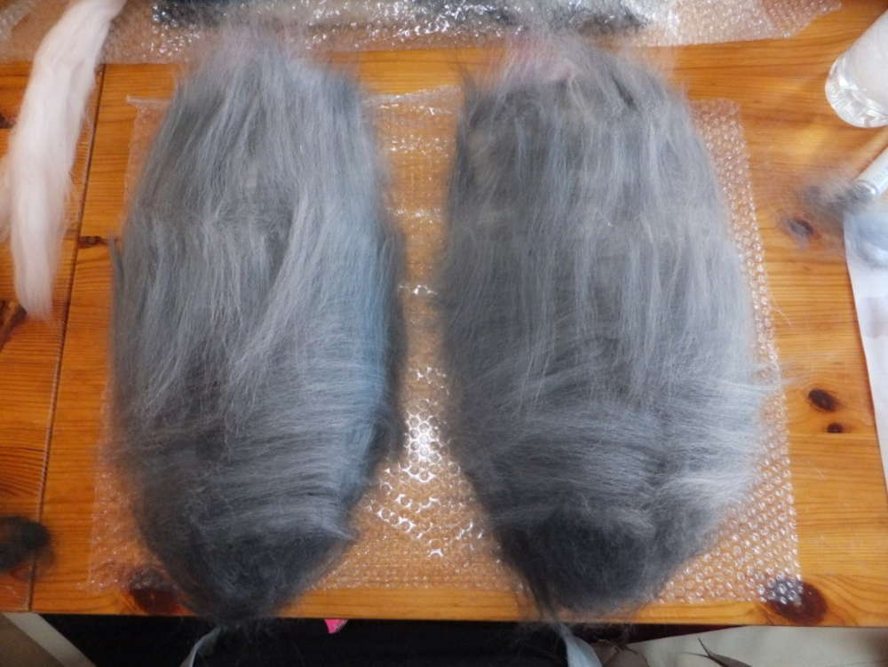

In der gleichen Legetechnik, wie auch schon beim Hut, werden mehrere
Schichten gelegt. Am besten macht man die Ohren parallel, denn sonst
vergisst man leicht welche Farben man in welcher Schicht verwendet hat.
Ich habe die Ohren von der zukünftigen Inneseite her aufgebaut. also
erst das rosa Innenleben und dann Schicht für Schicht das Grau mit den
dunkleren Spitzen aufgelegt. Und wieder einnässen.

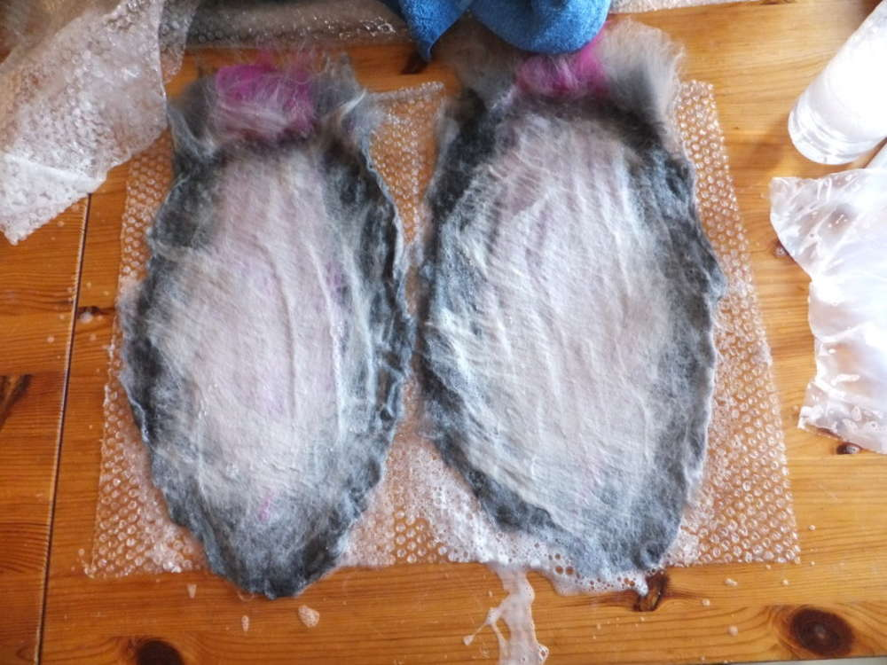

Bei flachen Filzarbeiten ist es nicht so schlimm wenn die Ränder etwas
unregelmäßig sind, die kann man wenn genug angefilzt ist mit einer
Schere nachschneiden und dann die Kanten nachfilzen. Da die Ohren an den
Hut rangefilzt werden sollen, bleibt der Löffelansatz unbehandelt, damit
er später an den Hut rangesetzt werden kann. Und das Anfilzen war auch
für mich neu. Telefon ausstöpseln, Facebook aus und bloß keinen Besuch
erwarten, jetzt muss man gaaaaanz vorsichtig arbeiten.

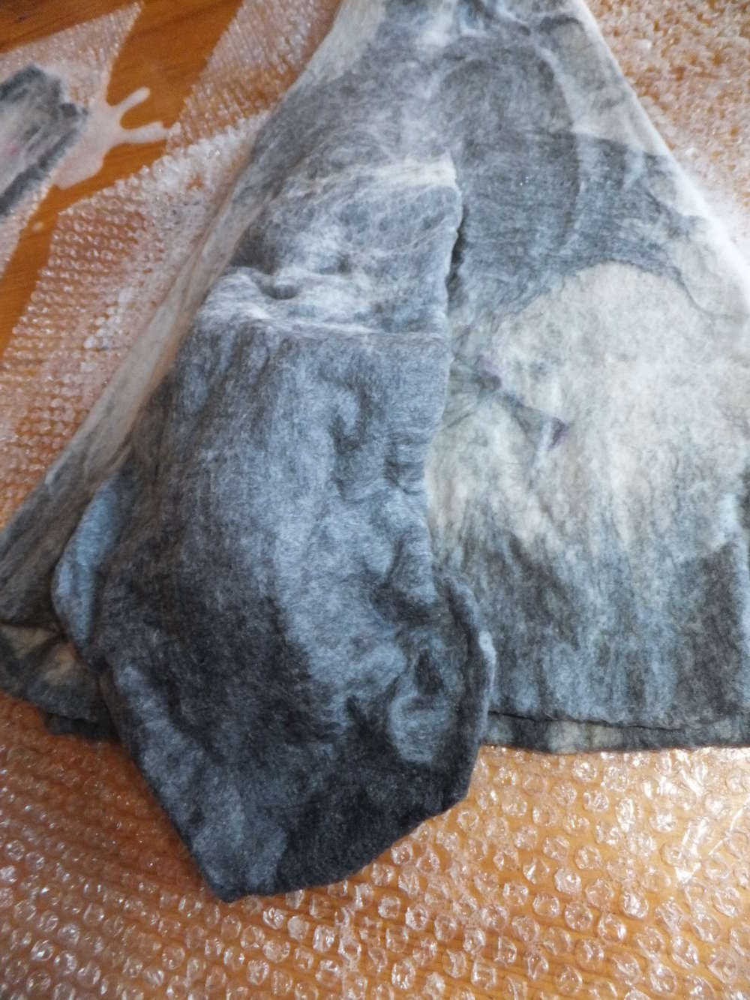

Die Ohren einklappen, damit es richtige Löffel werden, dann das
unbehandelte Ende etwas auffächern und auf den Hut an der richtigen
Stelle ansetzen. Dafür die trockene Wolle an der Stelle des Hutes
aufdrücken, sie tränkt sich dann mit dem Seifenwasser des Hutes. und
jetzt noch gleichfarbige Wolle in verschiedenen Richtungen um das Ohr
herum auflegen und ebenfalls anfeuchten. Lege dir ein Fliegengitter auf
die Wollschichten, so verrutschen sie nicht. Jetzt wieder ganz
vorsichtig reiben und wenn man das Gefühl hat es hält einigermaßen dann
lieber nochmal so lange weiterreiben ;). Dann kann mit dem vorsichtigen
Walken begonnen werden. Bitte nur ganz seicht die Wolle
aufeinanderreiben, noch sind wir im kritischen Stadium! So, wenn beide
Öhrchen an der richtigen Stelle sitzen dann wollen wir die mal so
richtig walken, jetzt wird der Filz dicker und der Hut stabiler und
robuster aber er schrumpft auch. Also aufgepasst, wenn man zu viel walkt
passt er am Ende nicht mehr, also immer mal schauen ob der Kopf noch
reinpasst und wenn er die richtige Größe hat, geht es an die Feinarbeit.

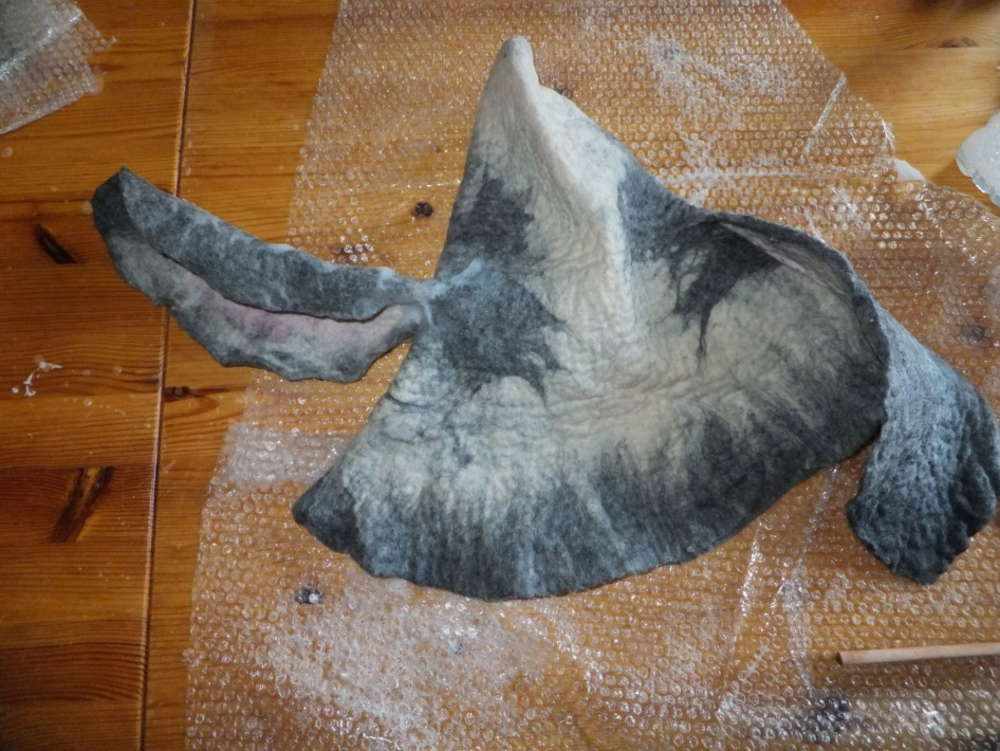
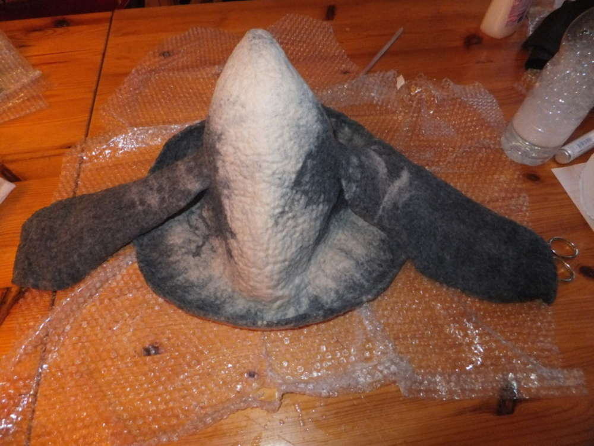

Jetzt muss die Krempe in Form gebracht werden und die Löffel brauchen
noch Form, der Zipfel soll auch noch nach hinten schauen, also... walk,
walk, walk...scheint ok zu sein, waschen wir mal die Seife raus und
neutralisieren die Reste anschließend mit Essig und waschen nochmal
durch... ein letztes Mal anpassen und mit Zeitungspapier ausstopfen und
trocknen lassen. Dieser meiner Hüte braucht definitiv keine Stärke.

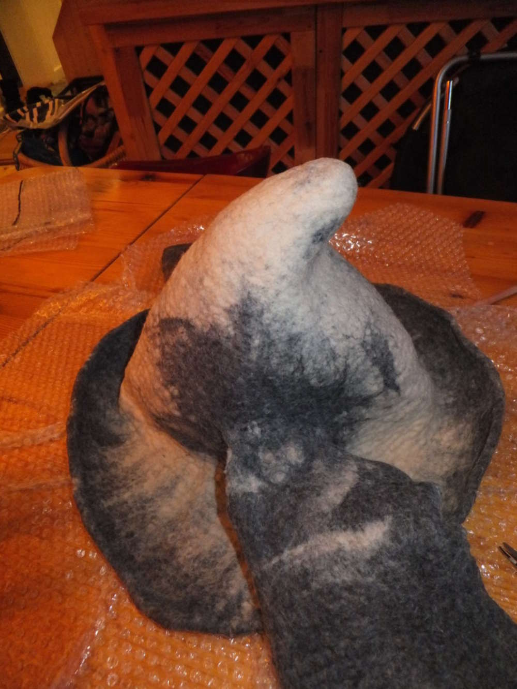

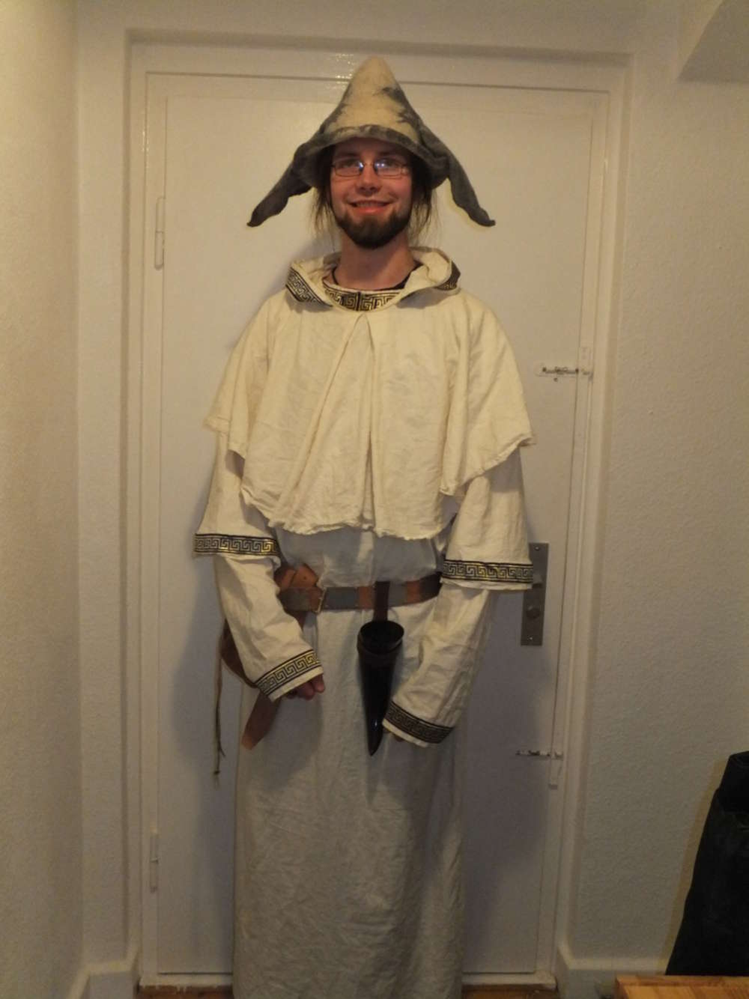
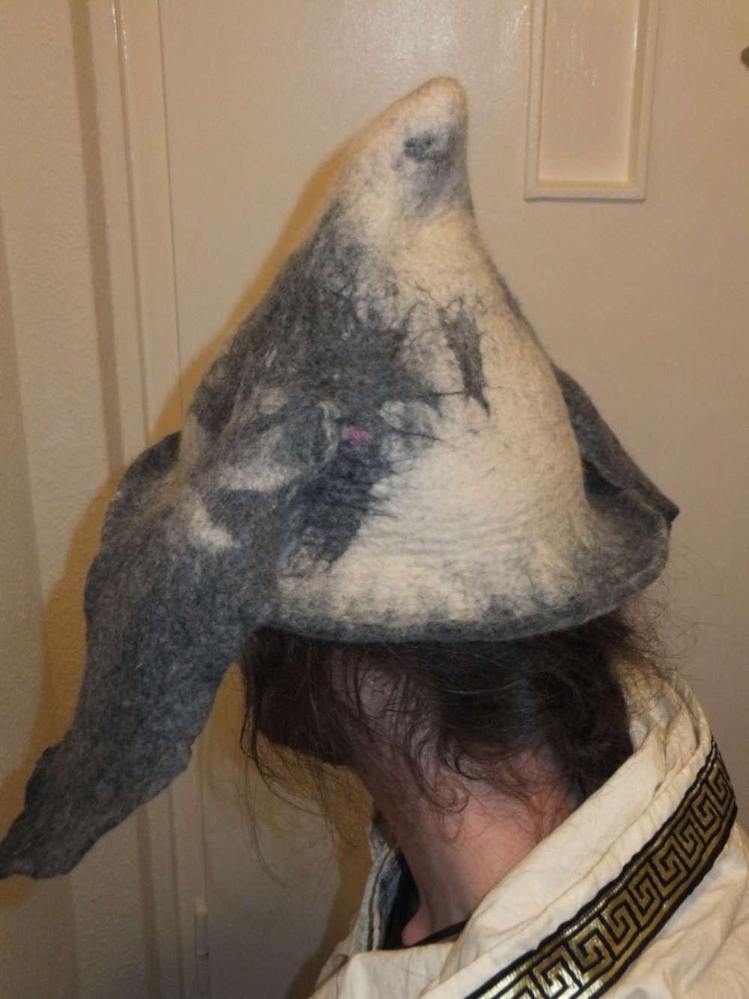

Tja, und nach 5 Stunden Non-Stop-Arbeit ist der Hut mit den Hasenohren
fertig. Und der Besitzer glücklich, wie man sieht.    
