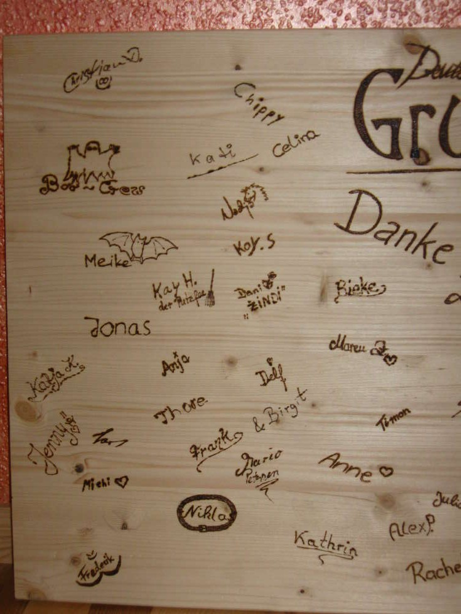
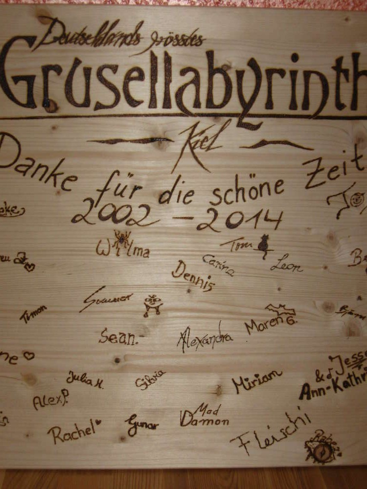
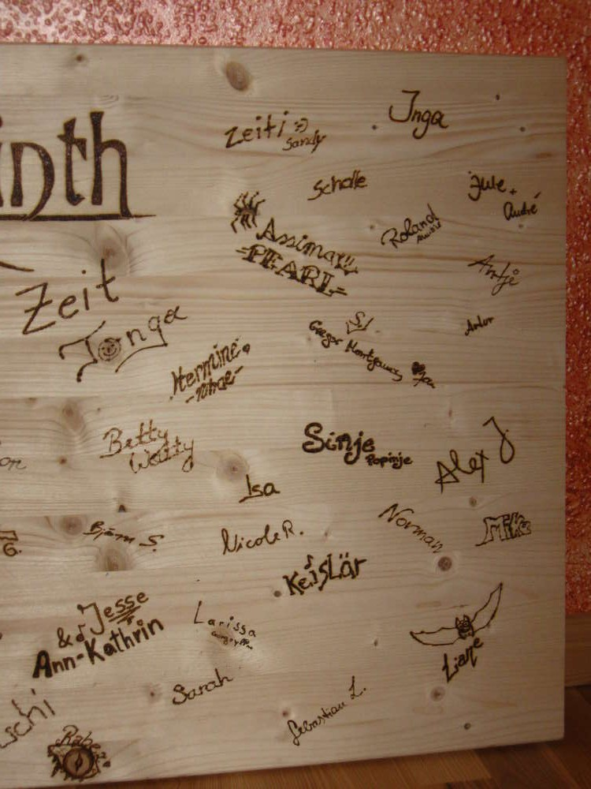

Nachdem ich trauriger Weise den Umzug meiner langjährigen Arbeitsstelle
dulden musste, habe ich (als Andenken von uns Mitarbeitern für die
Chefs) eine hölzerne Gedenktafel ins Leben gerufen. Ich muss hier nicht
schreiben für welche Attraktion ich mit viel Freude gearbeitet habe, das
steht immerhin dick und fett drauf. (Aufgrund der Überlänge ist es aus
drei Fotos zusammengeschnitten.) Aber es waren 5 Jahre, die mich tollen
Menschen näher gebracht haben und auch den Spaß an der Arbeit nie haben
vergessen lassen. Auch nach dem Umzug fühle ich mich als Teil dieser
[Attaktion](http://www.grusellabyrinth.de/), die ihre Zelte in Bottrop
aufgeschlagen hat. Remember, remember...

:D In diesem Sinne, Danke für die schöne Zeit.
