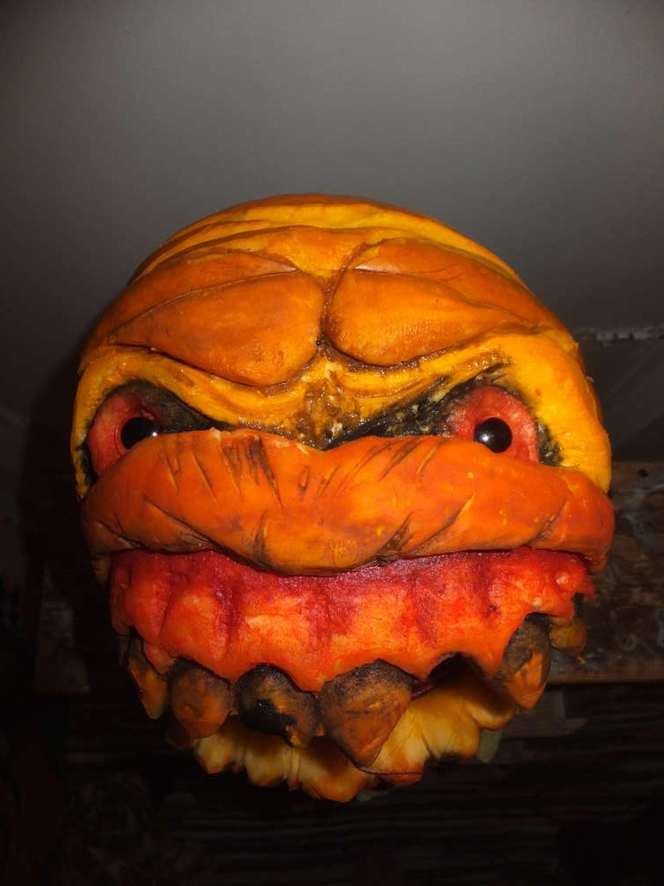
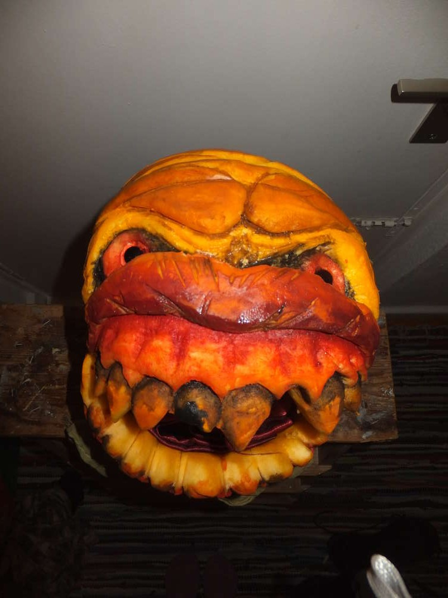
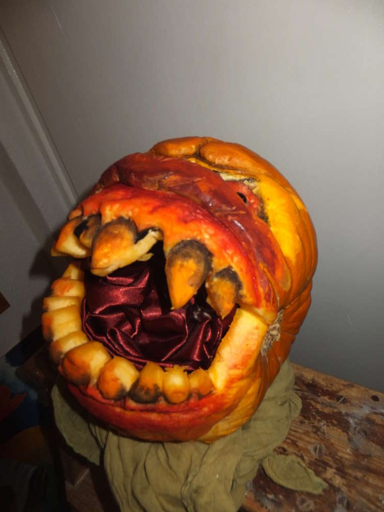
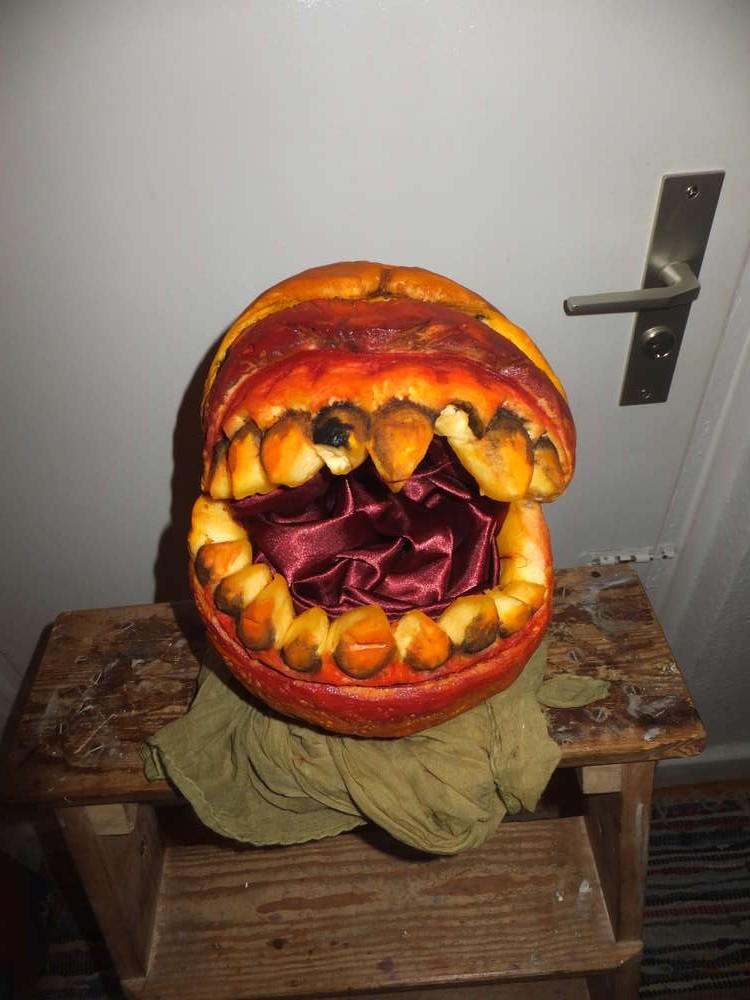
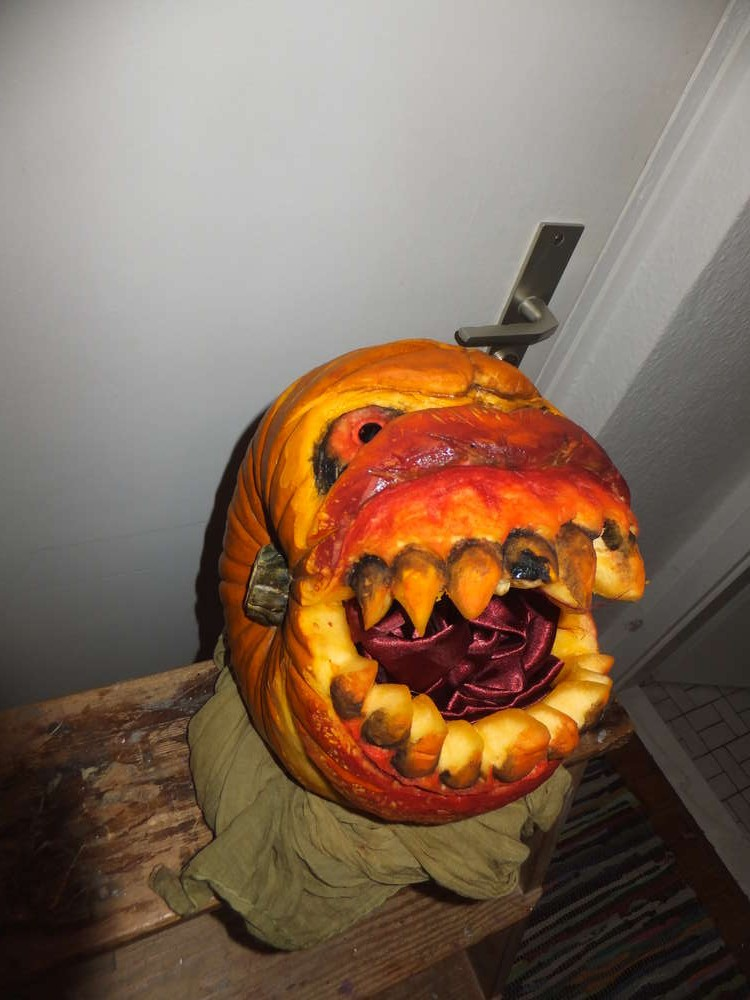
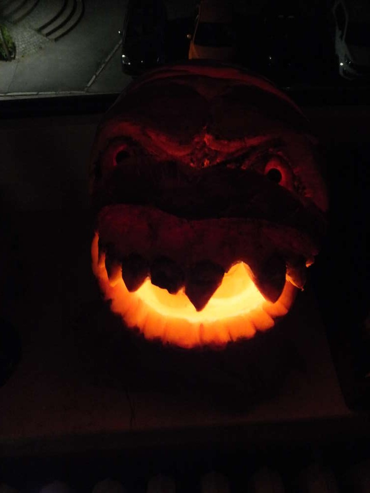

Es war ja nur eine Frage der Zeit, wann auch ich mich mal an eine
Kürbisfratze wage. Nachdem ich dieses Jahr den Kürbis als delikate
Erweiterung meines Speiseplans entdeckt habe, habe ich mir für 3,50€
einen Zierkürbis gekauft und mich heute mal darangemacht zu schnitzen.
Ich habe mir stundenlang Videotutorials angesehen und kam vom Hundersten
ins Tausendste... wie könnte es sein mit einer einfachen Schnitzerei ist
es nicht getan. Dann fand ich dieses Video auf Youtube
[http://www.youtube.com/watch?v=\_9iIz2i2gww](http://www.youtube.com/watch?v=_9iIz2i2gww)
und mich hats gepackt.

Anzeichnen Ausschnitzen Feinarbeit Anmalen 4 Stunden später... Ich ekel
mich selber vor diesem Ding. Insgeheim bin ich froh wenn er in einer
Woche anfängt wegzufaulen. Ich weiß tatsächlich nicht ob ich stolz oder
enttäuscht bin. Aber ich bin immerhin eine Erfahrung reicher und kann
sagen, dass ich schon eine Kürbisfratze geschnitzt habe. In diesem Sinne
Happy Halloween!!!
