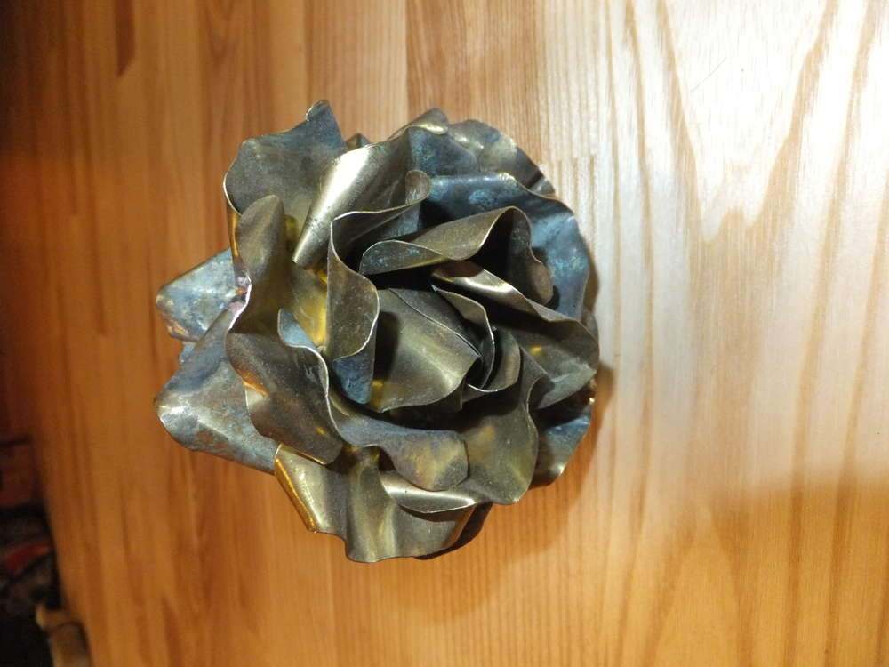
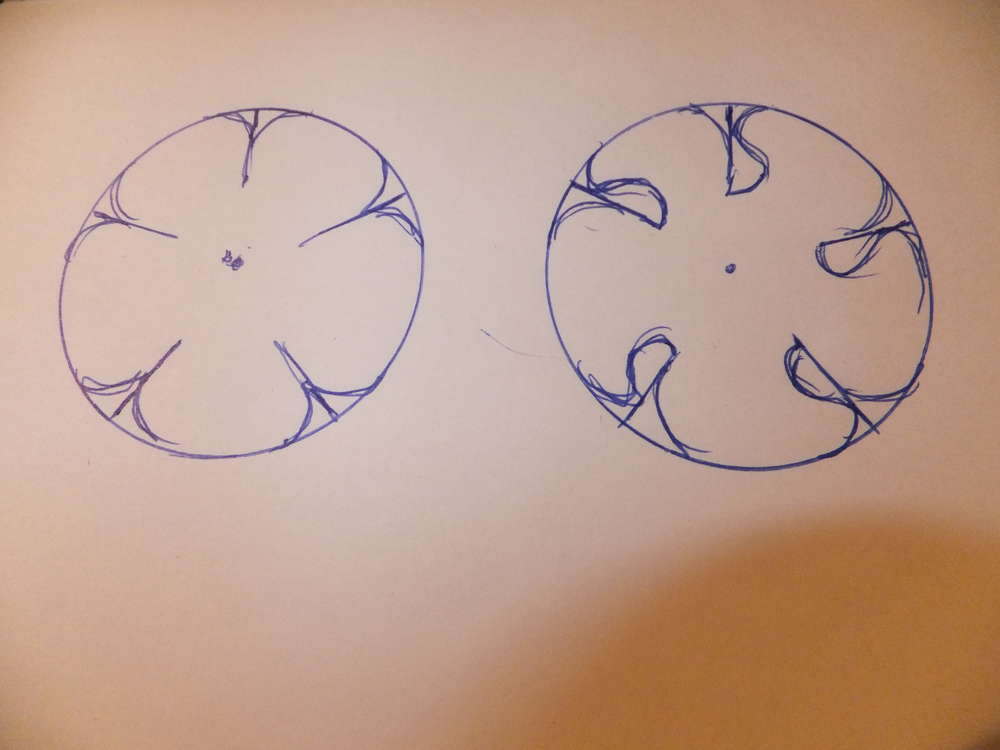
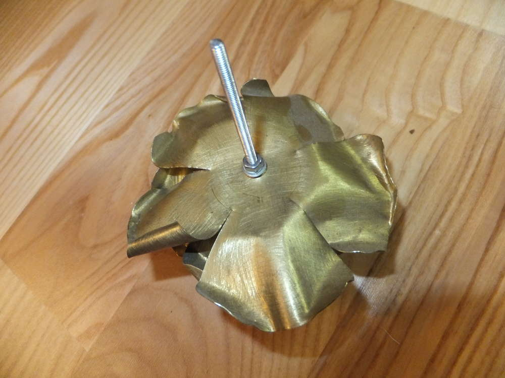
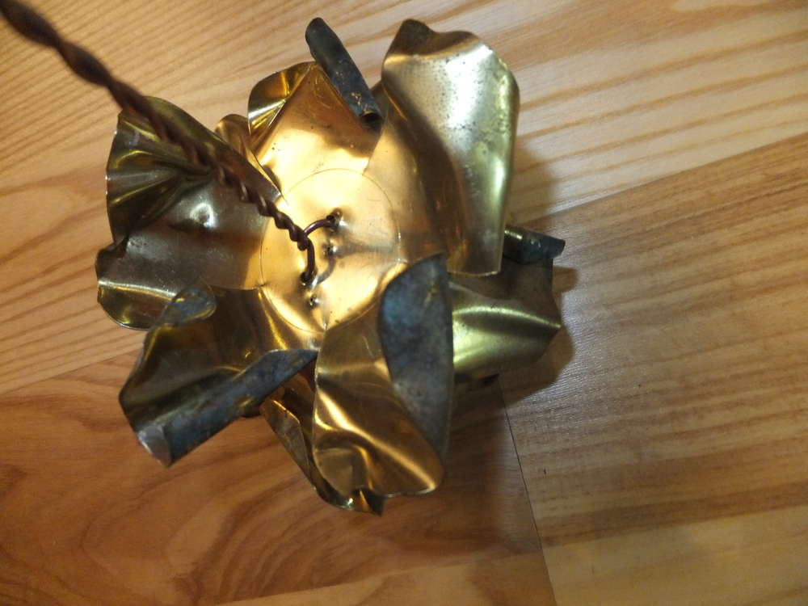
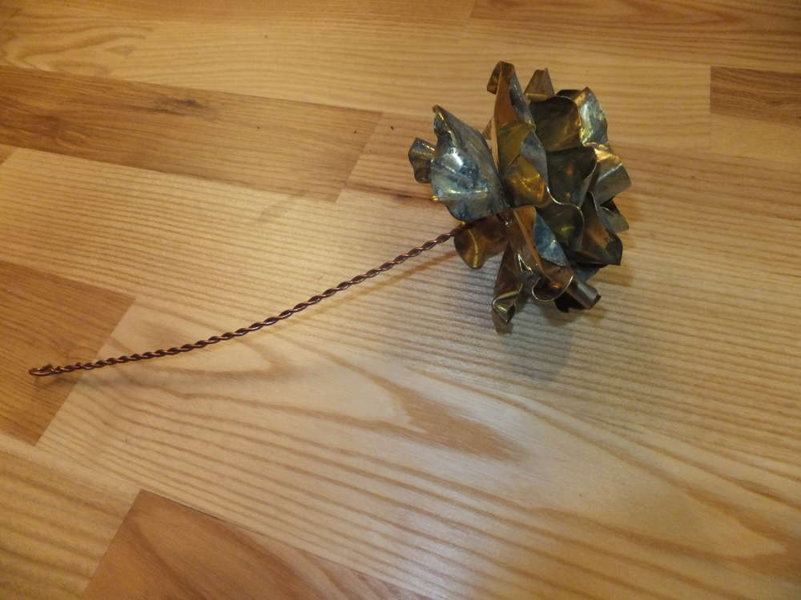
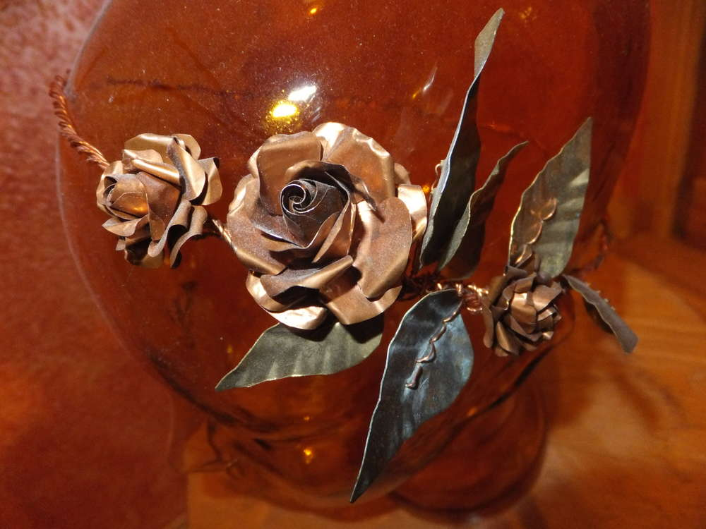
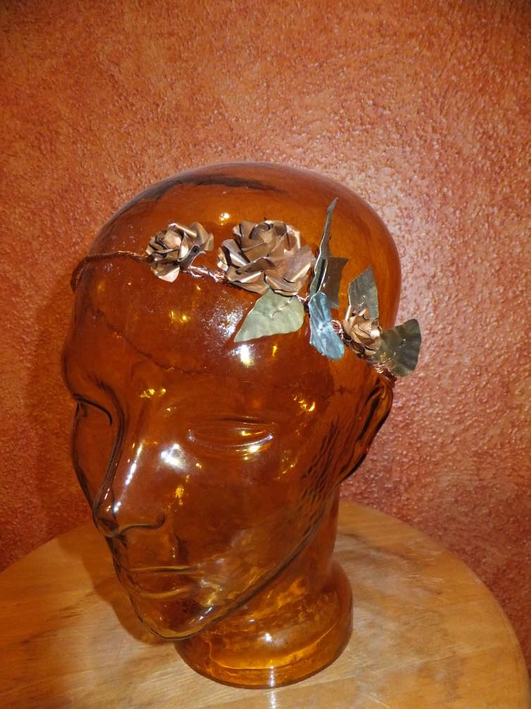

Tja hübsch sehen sie ja aus, aber das ist doch echt schwer - oder? Nö isses nicht. Das brauchst du: 
- Pappe, Bleistift und Zirkel, Schere 
- eine Blechschere 
- dünnes Kupfer- oder Messingblech 
- Draht 
- eine Rundzange 
- ggf. Schmirgelpapier 

Als erstes machst du dir 2 verschiedene Schablonen auf Pappe. 

Du machst dir zwei gleichgroße Kreise (je nachdem wie groß deine Rose werden soll) die du in fünf gleiche Stücke teilst. Wichtig hierbei: der Schnitt geht nur bis zum halben Radius, nicht ganz bis zum Mittelpunkt ran. Beim einen Kreis (hier links) rundest du die Stücke ab, dass er aussieht wie eine fünfblättrige Blume. Beim anderen Kreis machst du die Abrundung nur auf der einen Seite und auf der Anderen zeichnest du eine Welle ein, so wird das Blütenblatt schmaler und du kannst deine Mitte besser modellieren.

Diese Schablonen schneidest du aus und überträgst die linke drei mal und die rechte ein mal auf dein Blech und schneidest die "Blumen" aus. Der Punkt in der Mitte zeigt dir wo du einen Draht durchschiebst damit deine Rose einen Stiel hat und damit deine Blüte auch zusammenhält (das Loch kannst du zum Beispiel mit einem kleinen Nagel machen). Nun legst du die vier ausgeschnittenen Teile übereinander. Das Blech mit den schmalen Blüten nach oben, ziehe einen Draht durch die Mitte aller Bleche und biege ihn so um, dass die Bleche dicht beieinander bleiben und fixiert sind. Alternativ kannst du auch zwei Löcher machen die mindestens 1 cm voneinander entfernt sind, das macht es stabiler wenn du einen Draht durchschiebst und dann verzwirbelst (siehe links). In eine meiner Rosen habe ich auch einfach eine Schraube gedreht, man könnte sie also eventuell als Knauf für einen Schrank nutzen. 

Wenn du so wie ich ein relativ altes Blech hast, dass an einigen Stellen verfärbt und schedderig ist, kannst du mit dem Schmirgelpapier eine tolle neue Fläche schaffen, diese weist dann einige glänzende Kratzer auf je nachdem wie grob dein Schmirgelpapier ist und wie du schmirgelst in unterschiedlicher Variation. Mit dem Schmirgelpapier empfehle ich dir auf jeden Fall die Kanten zu entgraten, du kannst dies auch mit einer anderen metallischen Kante (z.B. Scherenrücken) machen, die du dann über die scharfen Kanten ziehst. Pass bitte bei der Arbeit mit Blech gut auf und schneide dich nicht. Wenn du gut mit Gartenhandschuhen arbeiten kannst und trotzdem ein Feeling für das Material hast, empfehle ich dir diese zu nutzen.

Jetzt beginnt die Modellier- und Biegearbeit mit der Zange, du arbeitest von Innen nach Außen. Die Mitte ist am kompliziertesten achte darauf, das sich die Blätter inneinanderwinden - soll halt aussehen wie eine Rose. Dann biegst du dir die Rose wie sie dir gefällt, jedes Blatt individuell. Und am Ende kann sie so aussehen...

Ich habe mir auch aus besonders dünnem Blech ganz kleine Rosen gemacht und sie in einen Kranz eingeflochten den man zu einem besonderen Anlass auf dem Kopf tragen kann. Dieser Passt besonders gut zu meiner [Kabelverwirrung](http://flauschiversum.de/2014/04/282/ "Kabelverwirrung").

