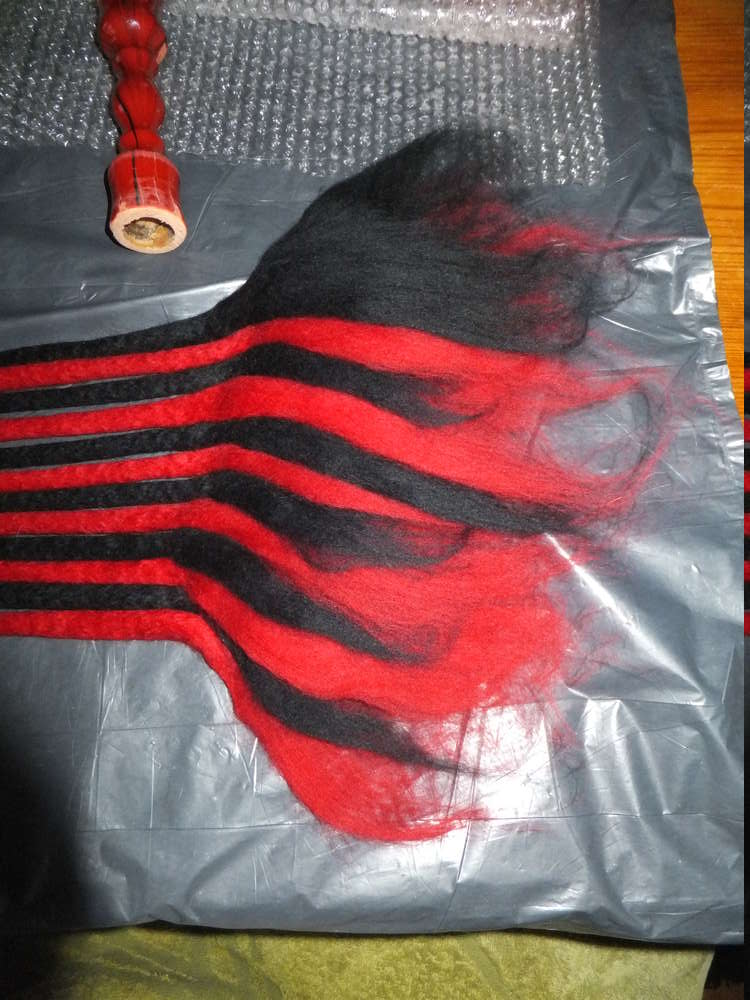
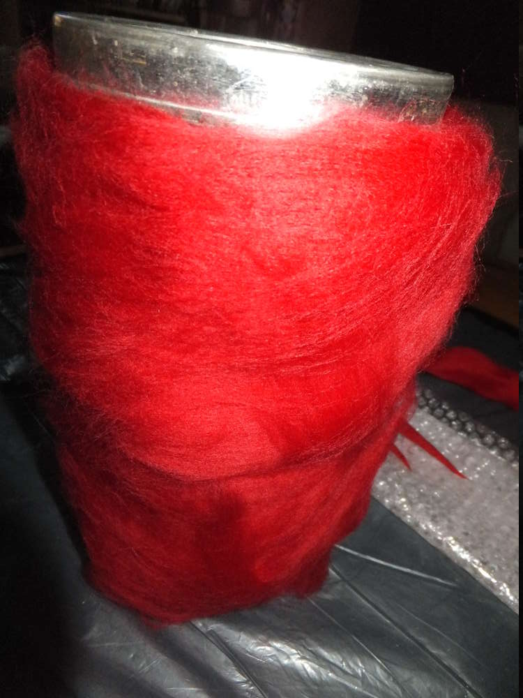

-   

1.  [1](#)

Das war mal eine verrückte Idee, die ich nicht ungefilzt auf mir sitzen
lassen konnte. Ihr sollt erst am Ende erfahren was da entstanden ist.
Man muss nur mit den gleichen ungewöhnlichen Menschen in ein Gespräch
kommen um an ungewöhnliche vielleicht sogar pikante Auftragsarbeiten zu
gelangen... Die folgende Anleitung soll als Anleitung fürs Schnürefilzen
dienen. Und das braucht ihr: Merinowolle aus dem Kammzug, eine
Wasserspritze, Luftpolsterfolie, ggf. ein Handtuch und Seifenwasser.

-   

1.  [1](#)

Ich möchte insgesamt 12 Schnüre haben, deshalb hab ich mir 6 etwa 70cm
lange Kammzüge abgetrennt und der Länge nach geteilt (so sind meine
Schnüre nicht ganz so dick, etwa 1cm wenn sie fertig gefilzt sind).

-   
-   

1.  [1](#)
2.  [2](#)

Jetzt muss ich mich jeder Schnur widmen und sie einzelnd filzen, da ich
sie am Ende miteinander verbinden möchte, bleibt bei meinen Schnüren im
Folgenden ein Ende ungefilzt. Ich lege also vor mich den Kammzug und
wässere die Luftpolsterfolie daneben!!! mit dem Seifenwasser (das ist
wichtig, denn gebt ihr das Wasser auf den Kammzug, wird dieser
zusammengedrückt und ihr bekommt nur sehr schwer wieder eine runde
Schnur hin). Jetzt kann ich die Schnur vorsichtig über die getränkte
Luftpolsterfolie rollen und die Außenseite meines Kammzuges wird mit dem
Wasser bedeckt. Wir wollen, dass die Außenseite anfilzt und sich der
Verfilzugsvorgang dann nach Innen fortsetzt. Ist die Außenseite erst gut
angefilzt kann ich ohne Probleme mit beiden Händen die Schnur Rollen und
Walken. Sie wird in Laufe dieses Prozesses immer fester, das Wasser
tritt aus und ihr werdet bemerken, dass sie schrumpft je stärker ihr sie
bearbeitet.  

-   

1.  [1](#)

Wenn mir die Schnur zu flutschig ist, sie aber gut mit Wasser getränkt
ist und gewalkt werden muss, dann nehme ich mir ein Handtuch und rolle
die Schnüre darauf. Das Handtuch gibt der Rolle Wiederstand und ich
rutsche nicht einfach nur über die Schnur, sondern kann sie wieder
rollen.

-   
-   

1.  [1](#)
2.  [2](#)

Ich habe mir nun meine 12 Schnüre gefilzt und um sie miteinander zu
verbinden habe ich wie oben schon erwähnt die einen Enden ungefilzt
gelassen, diese lege ich nun überlappend übereinander, sodass die Fasern
der verschiedenen Schnüre sich miteinander verbinden können.

-   
-   

1.  [1](#)
2.  [2](#)

Ich habe das Ganze dann aufgerollt und am Übergang von der verfilzten
Schur zum ungefilzten Ende ein wenig Wolle zum Zusammehalt
herumgewickelt. Dann habe ich alles zusammen wie eine große Schnur an
der Oberfläche angefilzt.

-   
-   
-   

1.  [1](#)
2.  [2](#)
3.  [3](#)

In diese angefilzte Schnur habe ich einen Holzstiel gesteckt, die Wolle
um ihn herum angelegt und noch rote Wolle fest um ihn herumgewickelt,
dann wurde das Ganze wieder mit Seifenwasser getränkt, gerollt und
gewalkt und dann war der Stiel umfilzt mit den Schnüren dran. Gibt es
schon Vermutungen? Wascht euer fertiges Werkstück gut aus und
neutralisiert dabei mit etwas Essigessenz die Seife.

-   
-   
-   
-   

1.  [1](#)
2.  [2](#)
3.  [3](#)
4.  [4](#)

Weiter geht es mit dem Zubehör zu dem oben beschriebenen Werk.

-   
-   
-   

1.  [1](#)
2.  [2](#)
3.  [3](#)

Mit ein bisschen fummeligen Handgriffen entstanden ein paar flauschige
Handschellen im gleichen Farbdesign wie die (mir wurde gesagt es hieße
Flogger, ich nenne es) Peitsche. Na dann viel Spaß ;)
