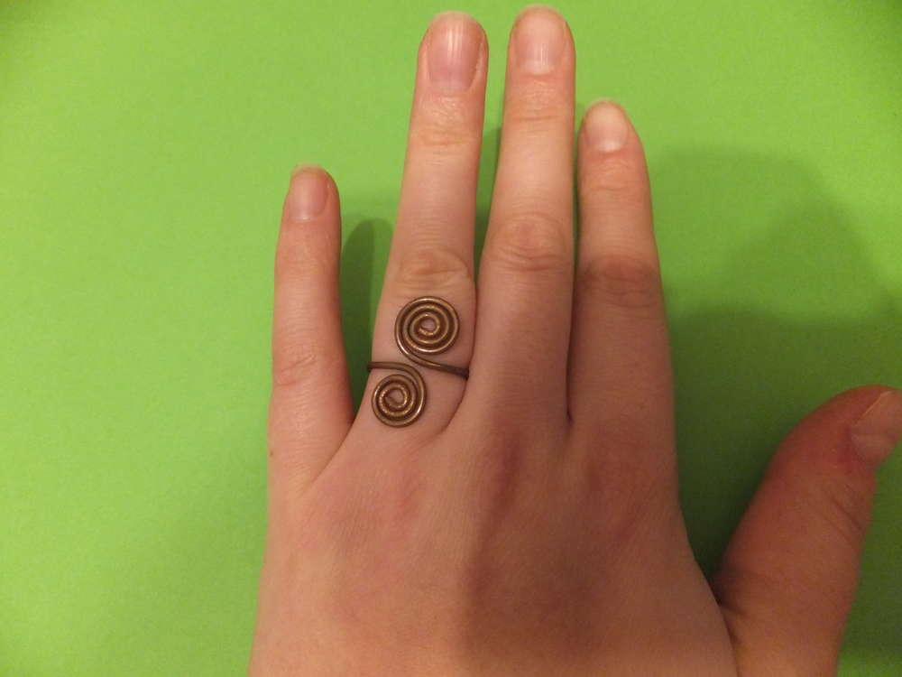

Also wer kennt das nicht: einem ist langweilig und zufällig liegen ein paar alte Kabel herum, die zu kurz zum... ähhh... verkabeln sind und sonst weggeworfen werden würden? Na nix wie ran an den Abisolierer und schön die Drähte verflechten... das kann sich sehen lassen; mit der Rundzange die Enden verzwirbelt und Tadaa....

Und vielleicht noch ein kleines Ringlein dazu?

