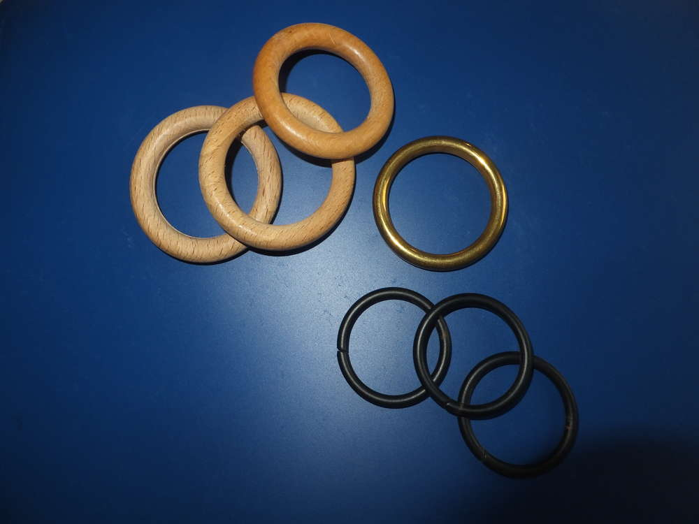

Wer brauchte nicht schon immer mal große, bunte Knöpfe haben oder in
gaaaaanz bestimmten Farben? Vielleicht in eckig oder oval oder rund oder
herzchenform???Du benötigst: Ringe (ich verwende alte Gardinenringe für
große Knöpfe) oder eine beliebige Form (du kannst sie zum Beispiel auch
aus dickem Draht selber machen), eine Nadel und Wollreste

Du fädelst deine Wolle in das Nadelöhr ein und führst den Faden durch
den Ring.

Stich mit der Nadel immer von unten nach oben durch den Ring und führe
sie durch die Schlaufe. Diese Technik nennt man Langettenstich.

So sollte es bei dir aussehen. Du umwickelst mit dieser Technik den
ganzen Ring.

Um den Anfangsfaden zu vernähen, schlingst du ihn einmal um den Ring und
umwickelst ihn mit dem Langettenstich bis der ganze Ring bedeckt ist.

Zum Vernähen stichst du mit der Nadel in die erste Schlaufe und schließt
das Umwickeln ab.

Drehe die äußere Kante nach innen, jetzt ist auch der Rest deines Fadens
innen.

Du beginnst damit den Faden sternförmig innerhalb des Rings zu
verteilen, nutze zur Befestigung die Stichkante.  Achte darauf, dass
dein Stern eine ungleiche Zackenanzahl hat, das ist wichtig für den
nächsten Schritt. Dein Stern endet dort wo du mit ihm begonnen hast, von
dort aus führst du deinen Faden zur gegenüberliegenden Lücke zwischen
den Zacken.

In dieser Lücke beginnt deine Webarbeit. Immer über einen Zacken drüber
und drunter führst du deinen Faden, durch die ungleiche Zackenanzahl
kann der Faden überlappend (wie Ziegel) die Webfläche bilden. So liegt
in der ersten Runde der Fden beim ersten Zacken oben und bei der zweiten
Runde unten. Du kannst Farbwechsel und andere kreative Ideen umsetzen,
wie zum Beispiel Perlen mit einweben oder Lücken lassen und Fäden
überspringen, lass deiner Kreativität freien Lauf.

Die neuen und Schluss-Fäden vernähst du mit einem großzügigen
Überschuss, denn damit wird dein Knopf später festgenäht.

Und so toll können deine Knöpfe dann aussehen und die
unterschiedlichsten Dinge aufpeppen.

