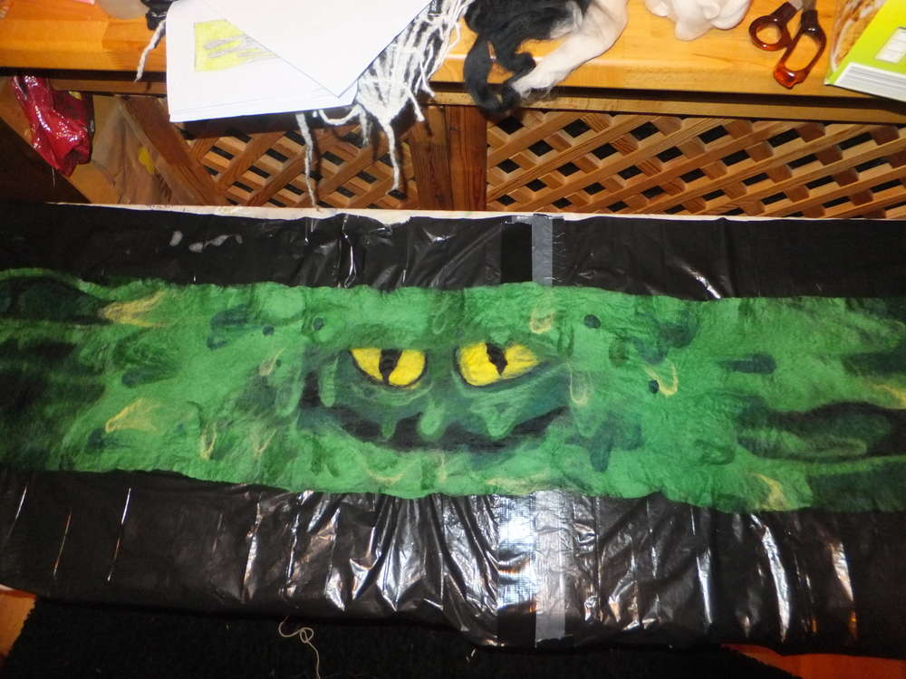
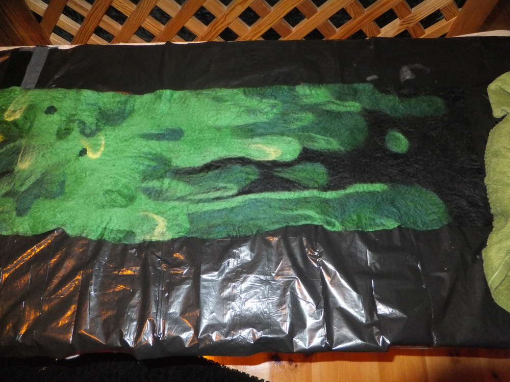
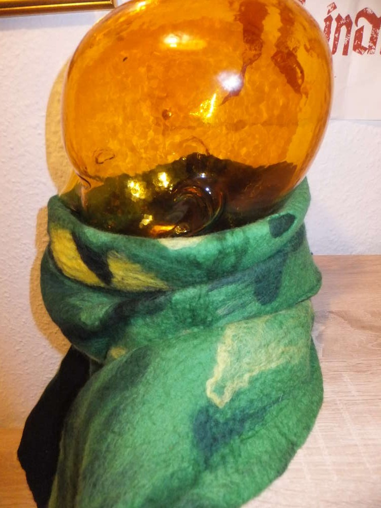
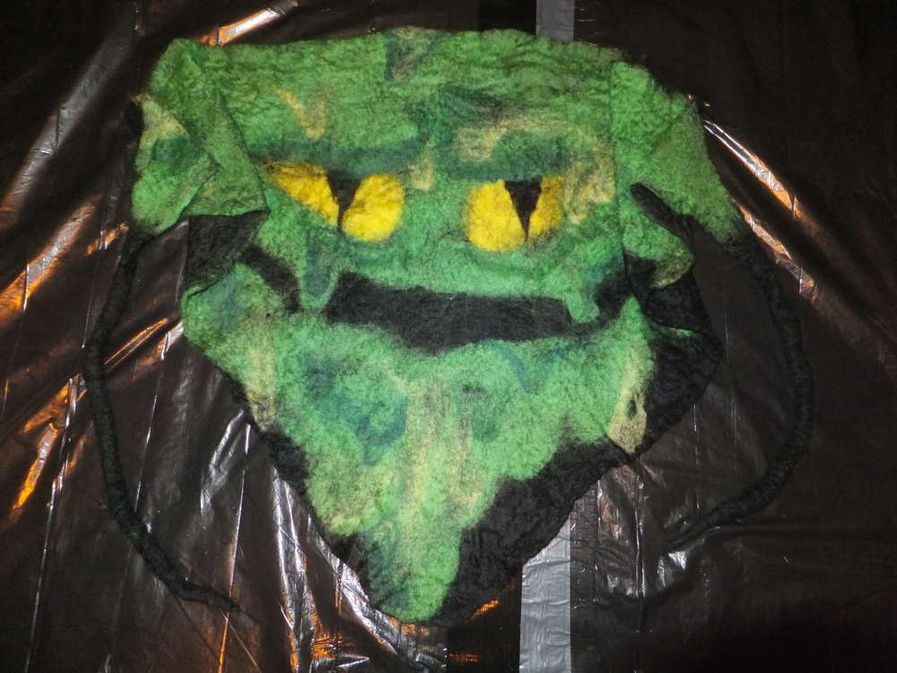
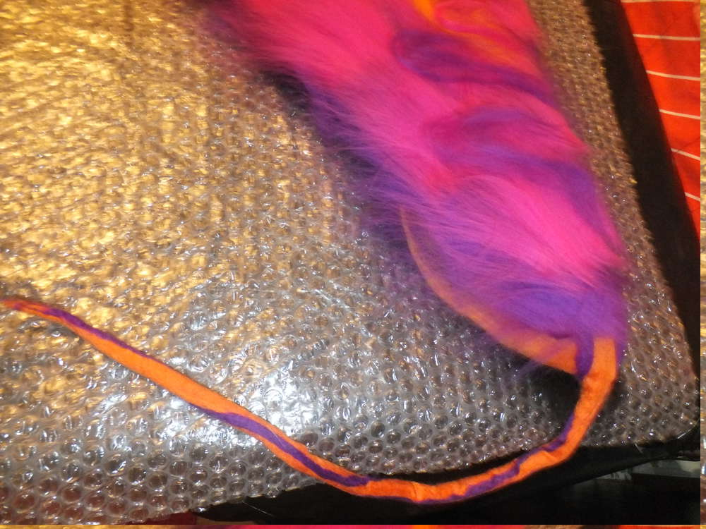

für die kalten Wintertage dacht' ich mir filz mal nen Schal in
Gruselmanier... Ja und wie das halt irgendwie immer ist, ist einer nicht
genug und so werden es immer mehr...  

-   

1.  [1](#)

Es begann tatsächlich mit einem Schal und einer konkreten Vorstellung,
die sich dann im Laufe des Prozesses zu etwas ganz Anderem entwickelte
als das, was ursprünglich angedacht war...

-   
-   
-   

1.  [1](#)
2.  [2](#)
3.  [3](#)

Um zu beginnen musste der Tapeziertisch von Mutti her und in dem eh
schon viel zu kleinen Wohnzimmer platziert werden. Ich legte 4 Schichten
schwarzer Wolle auf ca 200\*35cm Länge. und wollte eigentlich die
farbige Vorlage von oben umsetzen. Das ist mir auch ganz gut gelungen
finde ich. Naja während ich jedoch diese tollen Schleimtropfen mit der
Wolle modellierte, fiel mir auf, dass ein Gesicht auch ganz gut passen
würde. Und so machte ich mich an die Bleistiftskizze oben und versuchte
sie mit Wolle in die Realität umzusetzen.

-   
-   
-   

1.  [1](#)
2.  [2](#)
3.  [3](#)

Also gut ein Gesicht, jetzt war aber schon die Mitte des Schals mit
grünem Schleim bedeckt. Hmmm. Als erstes habe ich Augen gelegt, dann die
bösen Augenbrauen und dann habe ich um den Mund zu bilden, die ganzen
gelegten grünen Schichten aufgezuppelt bis das Schwarze untendrunter
wieder zum Vorschein kam. Das gefiel mir schon ganz gut. Jetzt fehlte
dem Ganzen nur noch der Feinschliff.

-   

1.  [1](#)

Also noch mehr Schleimfäden und Tropfen. Diese bekommt man super hin
indem man die Fasern aus dem Kammzug nicht mit den Fasern herauszieht,
sondern seitlich am Strang. die Wolle die zwischen den Fingern liegt,
bildet dann schon einen Tropfen und man muss nur ein wenig modellieren
um Größe und Form zu ändern.

-   

1.  [1](#)

Nach dem Legen des Motives habe ich ein wenig Seifenwasser aus meinem
Brauseball auf den Schal gesprüht, sodass die Fasern nicht mehr so
leicht wegfliegen, danach habe ich ein Fliegengitter darübergelegt und
begonnen die Wolle flach zu drücken um sie vollständig mit Wasser zu
tränken.

-   
-   
-   
-   
-   

1.  [1](#)
2.  [2](#)
3.  [3](#)
4.  [4](#)
5.  [5](#)

Jetzt geht es ans Massieren und Rollen am besten unter Zuhilfenahme von
Luftpolsterfolie. Wenn der Schal angefilzt ist, kann man die Arbeit
umdrehen und die ausgefransten Kanten mithilfe des Fliegengitters
Umklappen auf die Rückseite (in meinem Falle die schwarze Seite des
Schals) und gut anreiben. So bekommt ihr eine schöne gerade Kante und
müsst nichts wegschnippeln. Wenn alles soweit angefilzt ist, werde ich
gemein und brühe das Kerlchen mal so richtig ab. Schön mit heißem Wasser
im Becken ich lasse dazu sicherheitshalber noch das Fliegengitter dran.
Dann immer wieder im Wasserbad bewegen und mit kaltem Wasser ausspülen,
dann nochmal heiß und nochmal kalt und dann wieder mit Seifenwasser
walken. Das kann jeder handhaben wie er will, so sind bei mir die
Arbeitsschritte eingeprägt und so mache ich es auch, wer ein anderes
Vorgehen für besser befindet, dem sei da freie Hand gelassen.

-   
-   

1.  [1](#)
2.  [2](#)

So wenn der Schal gut verfilzt ist und auch von der Festigkeit für dich
in Ordnung ist (je stärker du walkst, desto steifer wird der Schal
später) kann der Rest Seife ausgewaschen und mit Essig neutralisiert
werden. Wasch danach dein Werkstück gut aus. Jetzt heißt es trocknen
lassen, am besten in ausgebreitetem Zustand, denn wolle hat ein
Gedächtnis und wenn sie in einer bestimmten Form trocknet, so behält sie
diese auch weitestgehend nach dem Trockenvorgang und wir wollen ja
keinen Knitterschal... obwohl. Nee lieber doch nicht

-   
-   
-   
-   

1.  [1](#)
2.  [2](#)
3.  [3](#)
4.  [4](#)

Wenn er denn Fertig ist sieht er so aus.  

-   
-   
-   
-   

1.  [1](#)
2.  [2](#)
3.  [3](#)
4.  [4](#)

Und wie ich schon am Anfang geschrieben habe... es bleibt oft nicht bei
einem Schal. Diesmal ein brüderliches Dreieckstuch.  

-   
-   

1.  [1](#)
2.  [2](#)

Hier nochmal im Tragezustand.  

-   
-   
-   
-   

1.  [1](#)
2.  [2](#)
3.  [3](#)
4.  [4](#)

Und aktuell trocknet dieser ähhh... feuchte Traum in Violett-Rosa-Orange
und wartet sehnsüchtig auf seine Vollendung mit dem
Flauschiversum-Label.  

-   
-   
-   
-   

1.  [1](#)
2.  [2](#)
3.  [3](#)
4.  [4](#)

Uuuuund er ist trocken und hat sein Namensschildchen :)  
