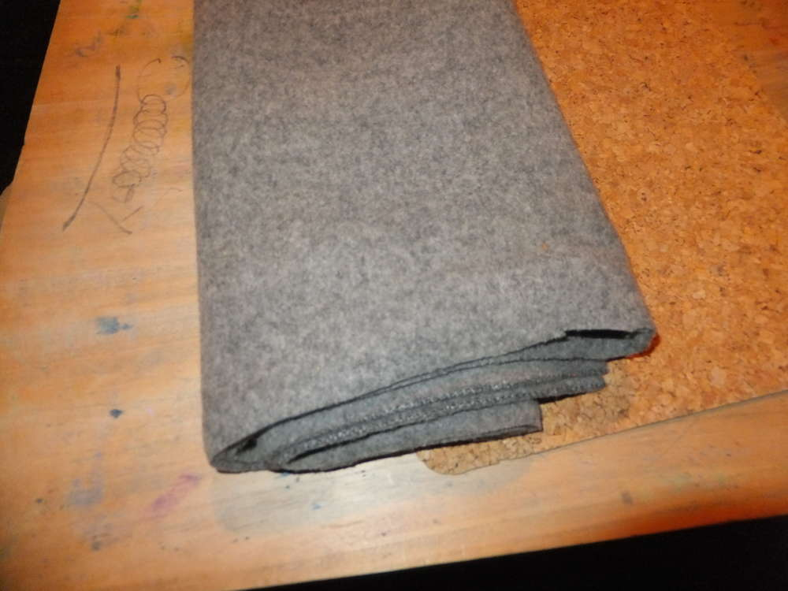
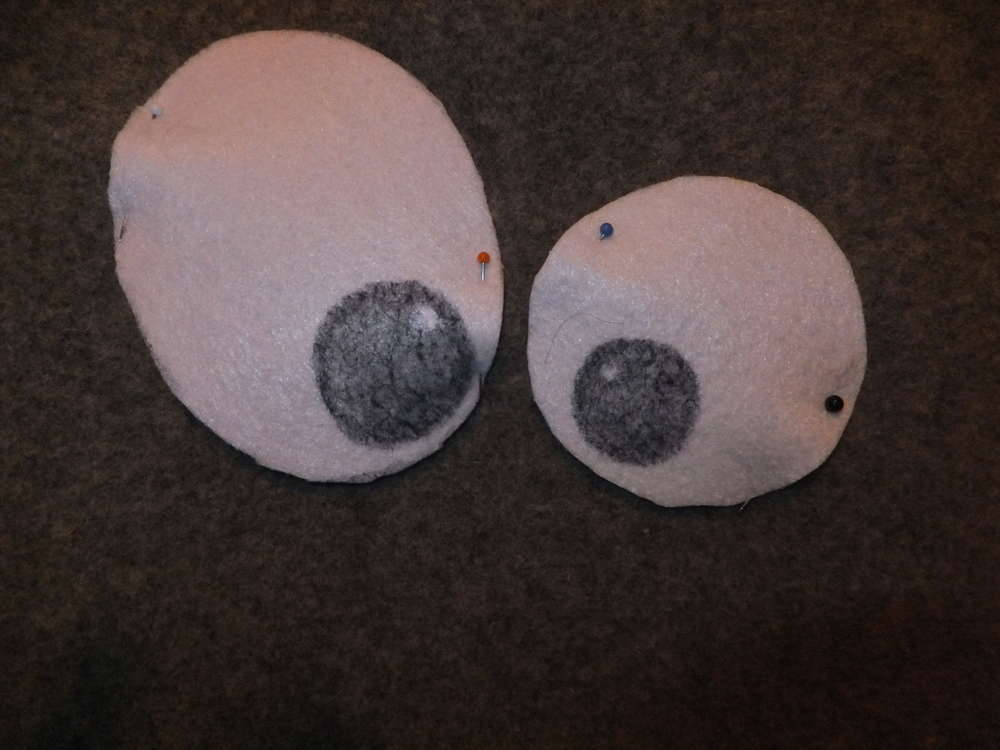

So wie fange ich an?\
 Am besten damit, dass ich mal in einem Spielzeuggeschäft stand und dort
neben diversen Handpuppen auch ein paar Umhängetaschen mit
Monstergesichtern hingen. Was geschah kann man sich denken, ich hab mich
verliebt, aber für meinen Geldbeutel waren die Taschen zu teuer und ich
tröstete mich mit dem Gedanken irgendwann einmal die Zeit und Muse zu
haben mir ein solches Exemplar selbst zu nähen. Die Zeit des Wartens ist
vorbei! Es folgt die zunächst vereinfachte Anleitung zu einer
Monstertasche, wie ich sie nähe.

Ich habe für dieses Monsterchen eine halbe alte Wolldecke verwendet. Du
kannst sie zum Beispiel in Outdoor-Shops recht günstig (20€) einkaufen,
du musst nur evtl. in Kauf nehmen, dass diese Decken etwas fusseln.

Zunächst habe ich meine Decke zerschnitten in eine Bahn von ca. 40 cm
Breite und 1,50 m Länge. (Schneide die Decke einfach an der kurzen
Seite, die ist in der Regel ca 1,5 Meter lang, es kommt dabei nicht auf
den Zentimeter an.

Schlage nun ca 2 cm des Stoffes um und nähe ihn fest.

Nun schau wie lang du deine Schleppe haben möchtest und stecke sie mit
Nadeln fest. Dann zeichnest du mit einem Frühstücksteller (oder einem
anderen runden Gegenstand) eine weiche Kante, dort wirst du später auch
entlangnähen.

Zwischen den Rundungen sollen nun die Zähne eingepasst werden. dafür
habe ich dickes Fließ genommen und mir die Zähne angezeichnet, sie
ausgeschnitten und daaaaaann...\
 ... legst du die Zähne in die Tasche, die immernoch auf links vor dir
liegt. Stecke nun die Zähne fest und nähe sie direkt mit ein, wenn du
die Kanten zusammennähst.

Wenn du das ganze festgenäht hast und wendest, sind die Zähne gleich
fest eingenäht und es gibt eine schöne Sicht von beiden Seiten. Jetzt
hast du deine schleppe mit einer versteckten Tasche genäht, die später
das Gesicht deines Monsters bilden wird.\
 Um dem ganzen mehr Stabilität zu geben (vielleicht merkt du, je nach
Dicke des Stoffes den du verwendest, dass sich die Nähte wieder nach
innen wölben) habe ich entlang der innenliegenden Kanten noch eine Naht
gesetzt (wenn du eine normale Nähmaschine nutzt sind 3 Schichten bei
Verwendung von Wolldecken das Maximum, das du ihr zumuten solltest),
diese Naht sorgt dafür das die Kanten sich nicht mehr nach innen ziehen
und sorgt zum anderen dafür dass Innen die Kanten nicht mehr offenliegen
und versteckt sind. Ich finde auch, dass die Naht das Gesicht einrahmt.

Die Schleppe lassen wir nun erst einmal in Ruhe und widmen uns der
Haupttasche. Diese wird aus dem Rest gemacht der (hoffentlich noch
mindestens doppelt so lang ist wie die Schleppe) hinter der Schleppe
übrig geblieben ist. Miss nun aus wie lang dieses Stück ist. Mit dem Maß
kannst du ausrechnen wie groß das Seitenteil sein muss, das du noch
einnähst. (Ist z.B. noch 1 Meter nach, so kannst du eine Seitenteil
machen das ungefähr 40 cm Hoch ist und 20 cm Breit ODER eines das 45 cm
hoch ist und 10 cm breit ODER ODER ODER, denn 2\*Höhe+Breite=1Meter) Die
Länge entscheidet also über die Länge der Naht vom Seitenteil. Meiner
hat die Maße 40 cm und 20 cm.\
 Die Ecken sind Abgerundet, so kannst du mit einer Naht alles festnähen
ohne absetzten zu müssen an der Ecke und es macht die spätere Form der
Tasche harmonischer.

Um die zugeschnittenen Seitenteile richtig positionieren zu können,
musst du nun darauf achten, wo das Innere und das Äußere deiner Tasche
ist. Bei dem nebenstehenden Bild sieht man (noch ohne Augen) das Gesicht
des Monsters, die versteckte Tasche ist unten, die Haupttasche will ich
auch mit einer schönen Naht nähen, also nähe ich die Tasche so auf
Links, dass die Nähte wenn ich sie wende auch innen sind. Orientiere
dich dafür an dem Bild, es ist recht schwer zu erklären, wie immer
darfst du auch gerne Fragen in die Kommis setzen. Nähe wieder 2 cm des
Saumes um, das ist später die Kante an der Taschenöffnung, mache dies
auch bei den Seitenteilen an der Kante, die (gegenüber der Abgerundeten
liegt) später ein Teil der Taschenöffnung bildet.\
 Wenn du die Kanten an der Taschenöffnung nicht umnähst, kannst du
später ggf. noch einen Reißverschluss einnähen. Bedenke diese Option,
ich erinnere an die 3 Stoffschichten als Maximum für deine Maschine.

Nun steckst du mit Nadeln die Seitenteile fest, achte dabei darauf, dass
du die Kanten bündig aufeinanderlegst.\
 Du nähst alles wieder mit einer geraden Naht zusammen und lass dir Zeit
bei den Rundungen, du müsstest ohne Faltenwurf durchnähen können.

Dann wendest du die Tasche und nähst wieder die Wulst wie beim Gesicht
an der Schleppe, gerade bei der Haupttasche gibt des der Tasche eine
gewisse Stabilität und Standfestigkeit.\
Nähe diese Wulst auch etwa 1 cm vom Boden entfernt, du kannst dich an
den Ecken der Tasche orientieren und dann mit Nadeln eine gerade Strecke
abstecken. Dann wird auch dein Boden der Tasche klar definiert sein. Du
kommst nicht unbedingt in die Ecken, wenn dein Stoff so dick ist wie
Meiner, das ist aber nicht schlimm, denn auch runde Ecken sind
harmonisch. :)

Kümmere dich nun um den Tragegurt. Ich möchte einen sehr breiten Gurt,
weil viele meiner Taschen mir nach einer Weile in die Schulter schnüren
oder die Gurte sich zusammenraffen und auch wieder unangenehmen bis gar
keinen Tragekomfort darstellen. Du schneidest also wieder eine ca 1,50 m
lange Bahn von deiner Decke ab und zwar 2 Mal in deiner Wunschbreite,
denk an die Nahtzugabe.\
Du nähst das Ganze wieder und wendest den Gurt. (Dazu muss ich sagen,
bei dickem Wollstoff ist ein breiter Gurt für diesen Schritt
vorteilhafter, da du den dicken Stoff sonst nicht gewendet bekommst.)
Nähe wieder die Wulst, so bleibt deine Tasche einheitlich. Nähe die
Träger in der gewünschten Länge an die Seitenteile deiner Tasche an,
arbeite  sorgfältig, diese Riemen tragen später das ganze Gewicht der
Tasche und ihres Inhaltes.

Grundsätzlich ist deine Tasche nun fertig, jetzt fehlen noch die Augen
und kleine Verschönerungen wie z. B. Druckknöpfe oder Reißverschluss.
Ich mss an den Zähen noch Ausbesserungsarbeiten durchführen, weil ich
leider nicht sorgfältig beim Festnähen gearbeitet habe und die Zähne
nicht komplett fest sind, auch steht die Naht trotz der Wulst noch so
unter Spannung, das es um die Zahnpartie blöd aussieht, deshalb Nadel
und Faden in die Hand genommen (ich nehme einen Wollfaden, denn es wird
auch beim Gesicht nun Nähte geben, die du nicht verstecken kannst, wir
sind also wieder beim Thema einheitliches Aussehen). Ich nähe also die
Zähne nochmal fest an die Kante an. Du siehst auf dem unteren Bild, dass
ich dafür von unten durch den Stoff und die Zähne durchsteche. Um wieder
auf diese Seite zu gelangen steche ich nur durch die Zähne
(Hohlsaumstich).

Weil erfahrungsgemäß der verwendete Filz fusselt und ausfranzt möchte
ich eine schöne Kante schaffen und setze mit dem Knopflochstich eine
Naht an der Kante entlang.

So es folgen die Äuglein. Dazu verwende ich wieder den Filz und schneide
ihn mir in der gewünschten Form aus.\
 Ich habe mir vorgezeichnet, wo ich die Pupillen haben möchte , diese
werde auch mit schwarzem Filz gemacht. Nun noch die Augen im Gesicht
positionieren und feststecken.\
 Festnähen... dies ist einer der erwähnten nicht versteckbaren Nähte,
deshalb nimm dir den Zickzackstich und umrunde das Auge sorgfältig. Mit
ein paar kleinen Lichtreflexen wirken die Augen echter und
ausdruckstärker.
