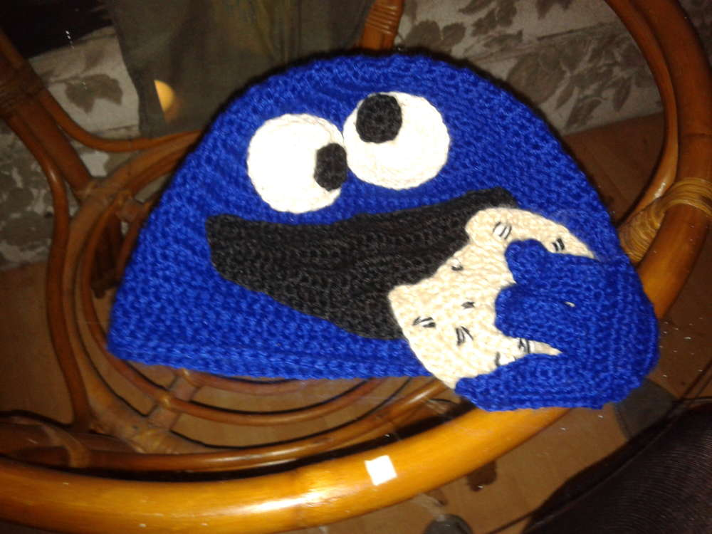

Nom Nom Nom... das ist meine Krümelmonster-Mütze, er hält sogar einen
gehäkelten Keks in der Pfote. Gehäkelt ist die Mütze nach der
Grundanleitung, die bei meiner Katzenmütze schon beschrieben ist, der
Unterschied sind hier die Augen, der Mund, der Keks und die Hand, eine
genaue Anleitung dafür habe ich nicht, weil ich selbst viel
herumprobiert habe und umso erfreuter über das Endprodukt bin. So ist
das manchmal mit Unikaten...
