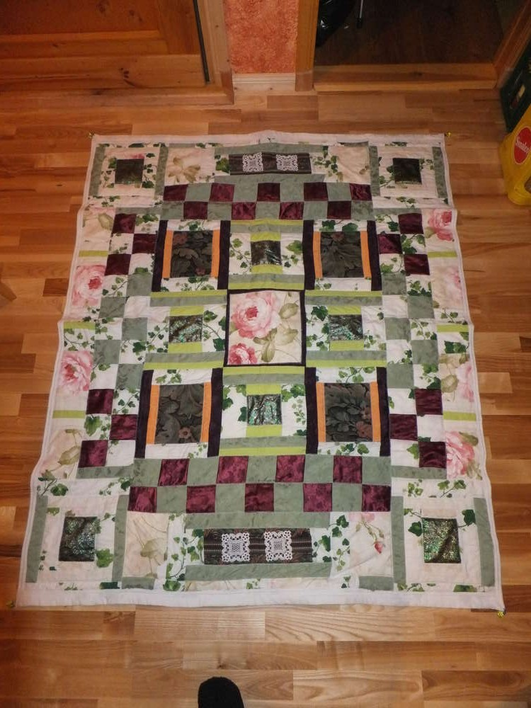
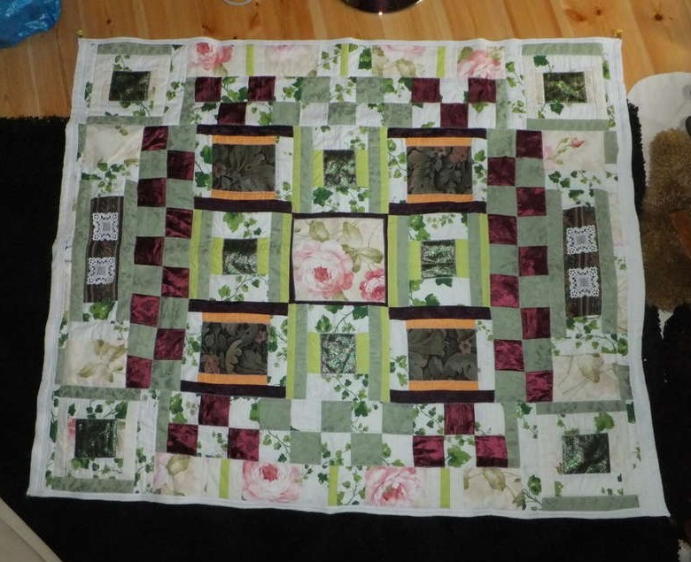
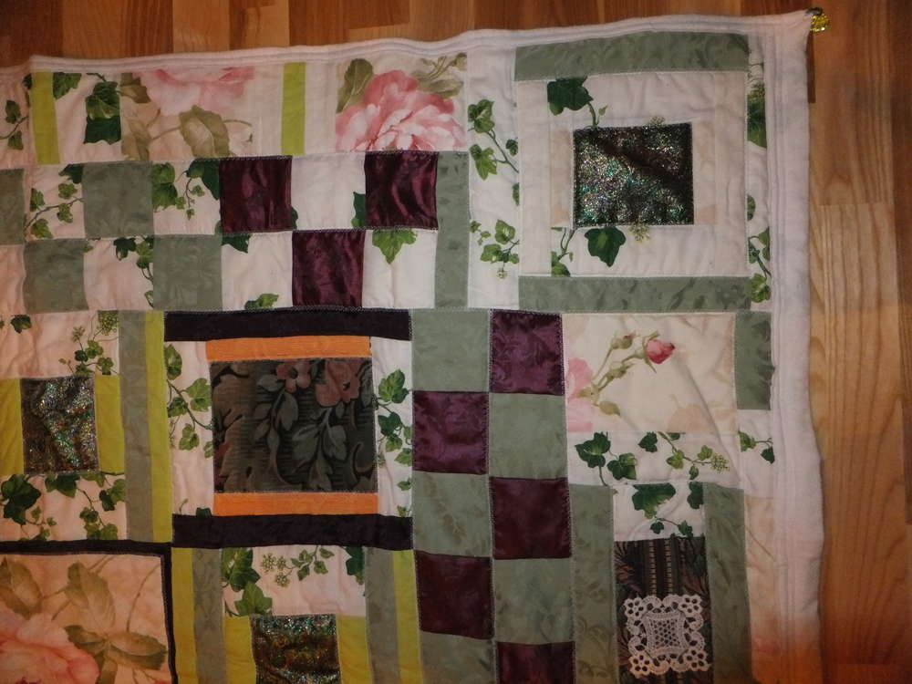
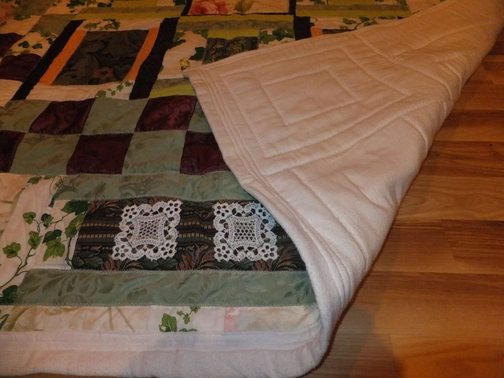

Was macht man wenn man schon immer eine selbstgenähte Tagesdecke haben
wollte? Ganz klar, man macht sich seinen eigenen Quilt, aber das
Füllmaterial ist Teuer und die Quiltstoffe auch... Falsch!!!! Mein Quilt
besteht aus den Stoffresten die ich habe, auch von alten Tops und
Kissenbezügen die kaputtgegangen sind etc. man kann alles verwenden was
einem gefällt. Letztlich habe ich (auch weil vieles vom Flohmarkt war)
ca. 10€ für die noch fehlenden Materialien bezahlt. Bei mir begann es
damit, dass ich ein Kissen machen wollte und es wurde stets größer und
größer, weil ich während des Nähens immer mehr Ideen bekam, wie man die
Patches erweitern kann, so entstand die erste Decke. Aber das war nur
das Oberteil, man konnte hinten noch die Nähte sehen und mir platzt der
Kragen wenn ich die Preise für professionelle Quiltfüllwatte sehe. Ich
entschloss mich für eine günstige Variante und holte mir zwei helle
Fleecedecken; übereinandergelegt sind diese schön fluffig und die
normale Hausnähnmaschine schafft die Dicke auch noch zu nähen. Als
Hinterteil nahm ich ein altes Biberbettlaken, es ist schön flauschig und
leicht zu nähen. Etwas kompliziert war das zusammenstecken mit Nadeln,
weil es ein echt großes Werkstück ist und man sich ziemlich piekst, wenn
man nicht sofort auf Sicherheitsnadeln zurückgreift. Letztendlich ist es
kein Profiquilt aber er ist selbstgemacht und dann ist man doppelt so
stolz darauf, besonders wenn die eigenen Nähkünste sich auf gerade Nähte
beschränken. ;) Die Maße sind 1,75m \* 1,35m.

