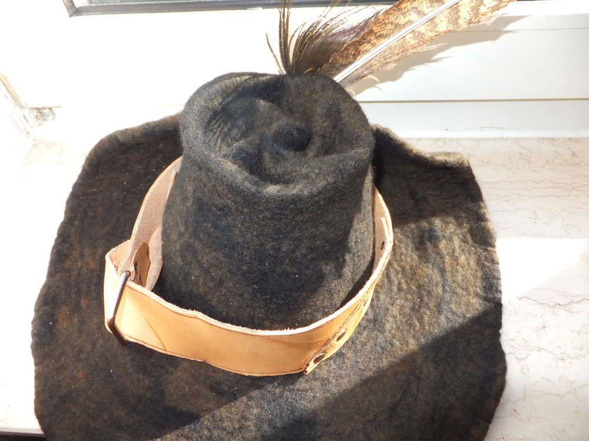
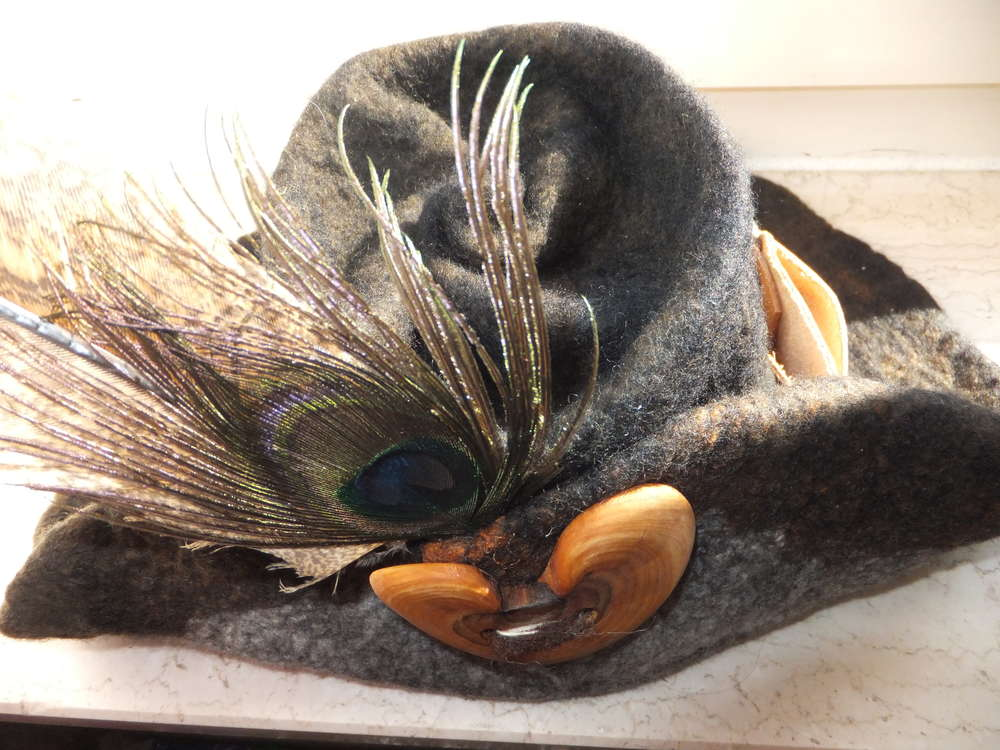

Nach langer Zeit hat die Ermeline mal wieder einen Hut gefilzt. Für diesen Räuberhut konnte ich die [Spitzhutvorlage](http://flauschiversum.de/2014/07/ermelines-neuer-hexenhut-2/ "Ermelines neuer Hexenhut") von den Zauberhüten nehmen und musste dafür einfach nur die Spitze umklappen. Wenn du das auch so machen möchtest, dann achte darauf, dass du den Hut noch nicht zu stark gewalkt hast an der Spitze, damit du eine schöne runde Form bilden kannst, denn du wirst von der geraden Kante der Vorlage Ecken an der Hutspitze haben.

Mein Zipfel hätte fast noch kürzer sein können, ich habe die Überlänge mittels eines Zwirbels versteckt. Das Praktische ist ja bei Wolle, wenn sie trocknet, behält sie die Form.

Hier noch ein paar Fotoeindrücke. Das Hutband ist aus Leder und wurde zunächst nur mit einer Schnalle und einem eingebrannten Rand versehen. Da kommt aber eventuell noch mehr ;) zwei Federn und der Holzknopf runden das ganze ab und zugleich wird die hochgeklappte Krempe an Ort und Stelle gehalten. Jetzt ist der Räuberhauptmann auch gut behütet.
