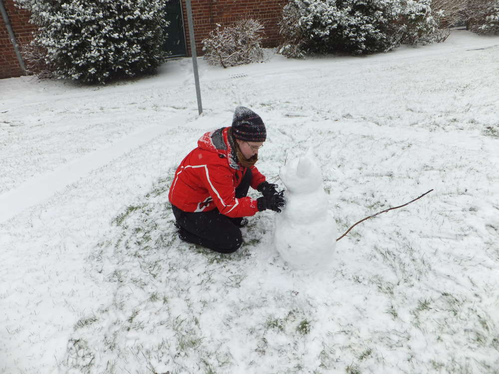

Ein lang gehegter Traum geht in Erfüllung. Wenn ich schon derzeit nicht meine eigene Hauskatze haben kann, dann doch wohl die Schneekatze im Hinterhof. Da wache ich also auf und sehe, es schneit schon wieder... Schneehose und -jacke rausgekramt, Handschuhe an und raus in den
Schnee...

Mit dem Schnee war es echt nicht leicht eine Kugel zu formen aber die Größe hat mir gereicht. Der Rest der Katze musste ja auch nur modelliert werden, sie sollte jetzt so ca. 80 cm hoch sein und ich kann ihr Antlitz von meiner Wohnung aus supi sehen.
