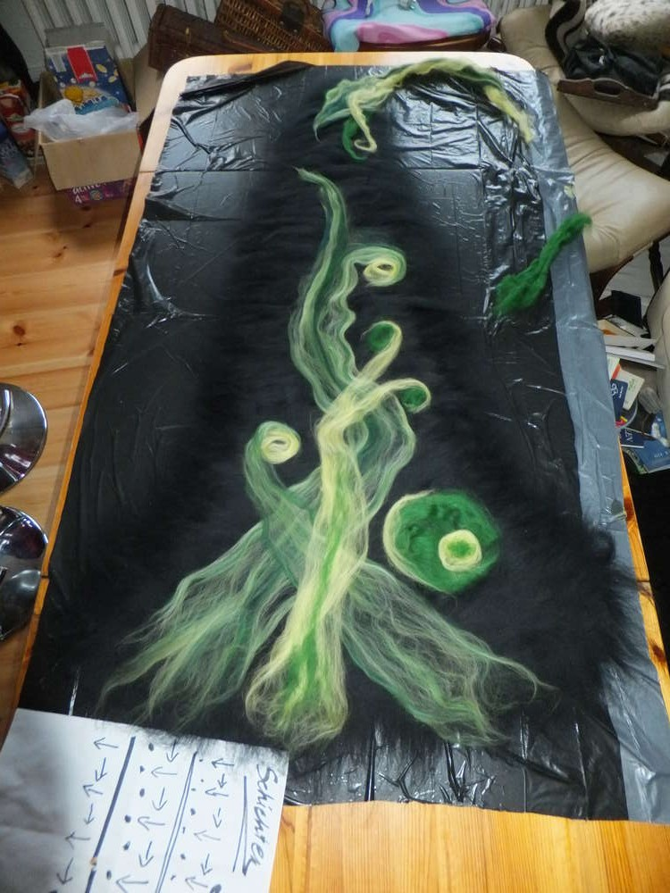
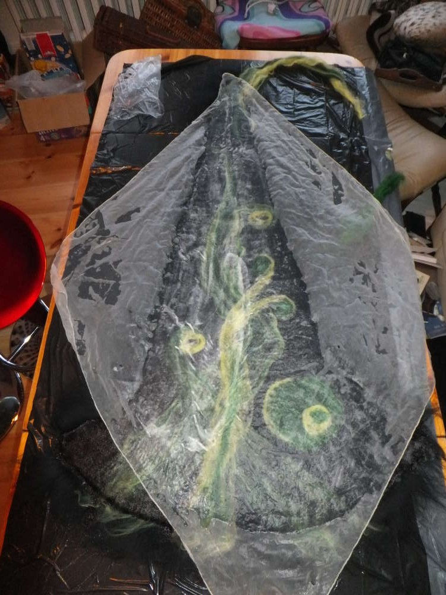
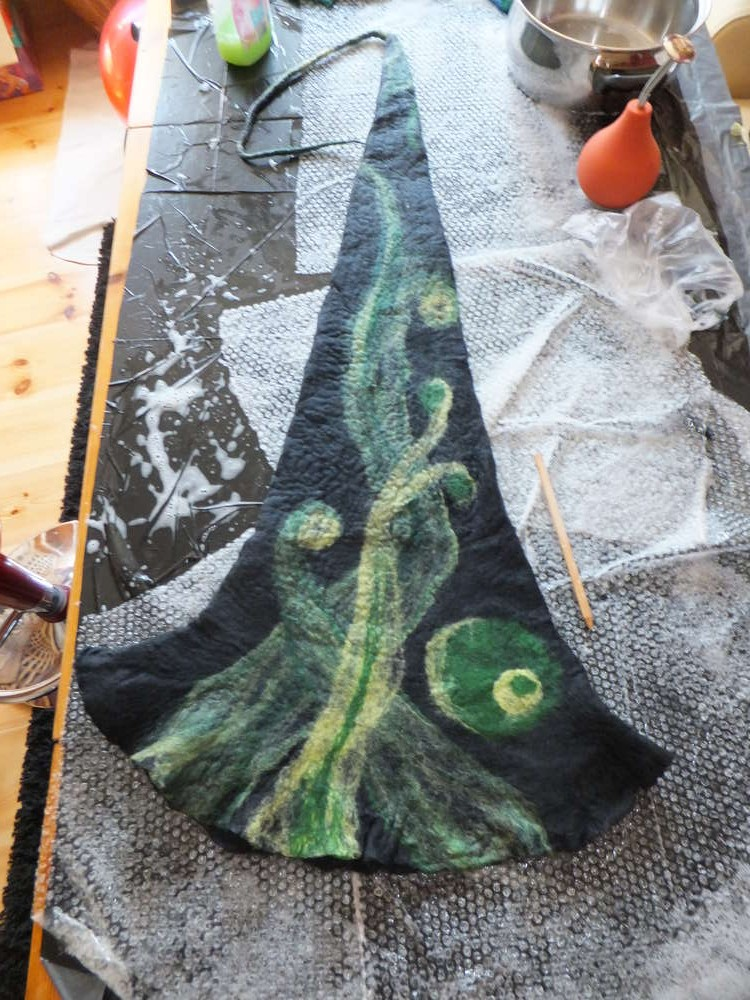
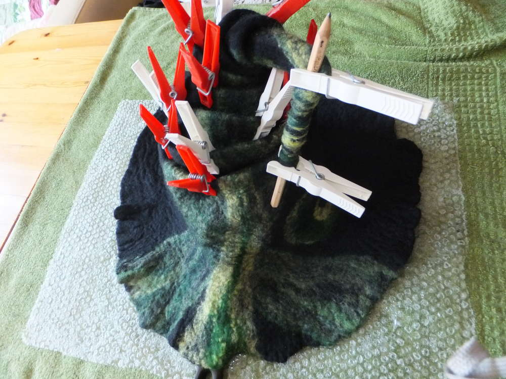
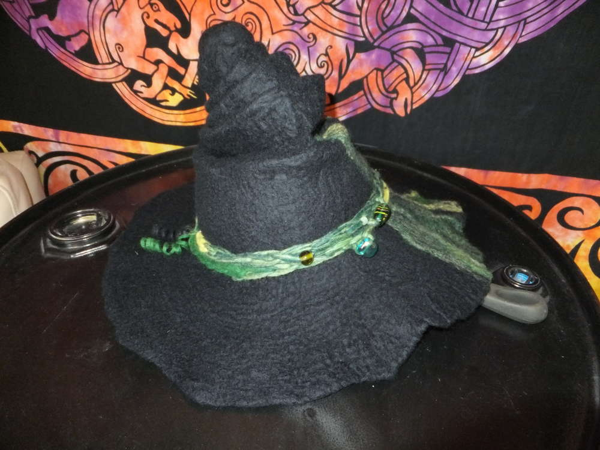
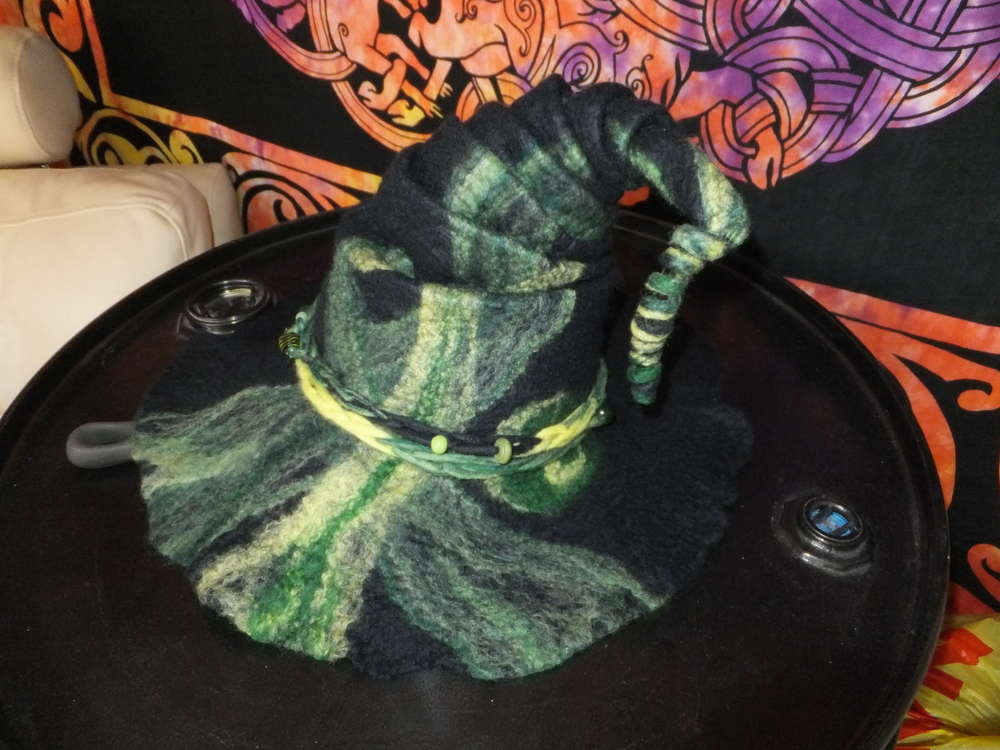
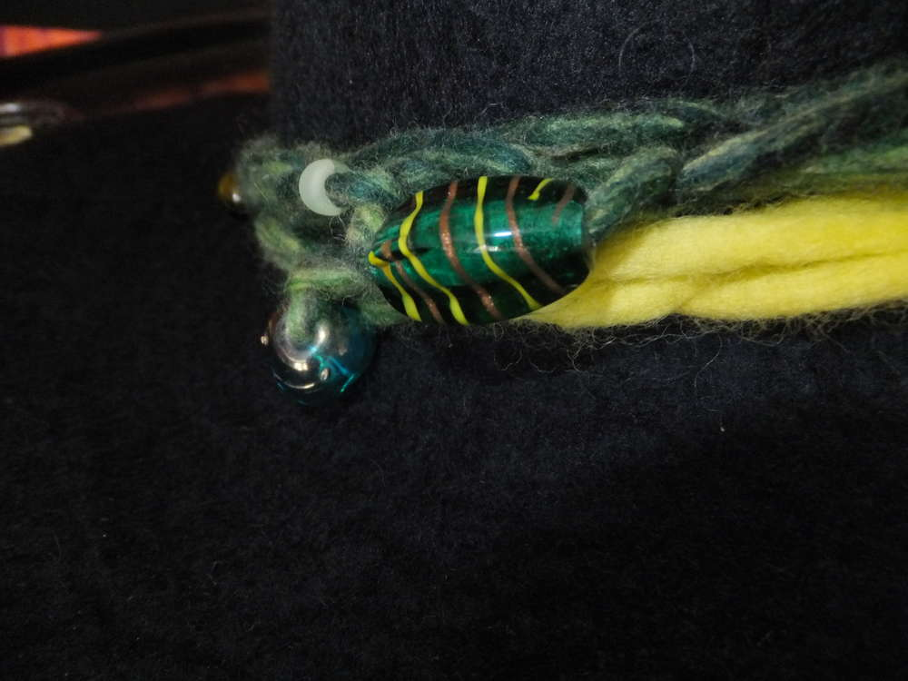
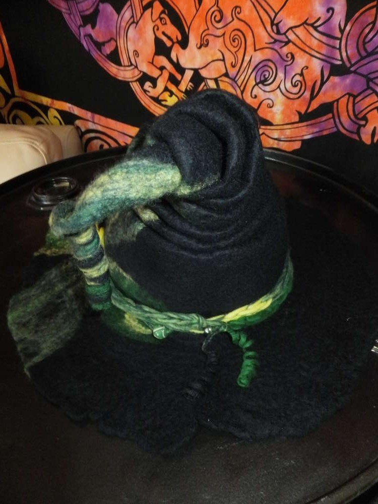
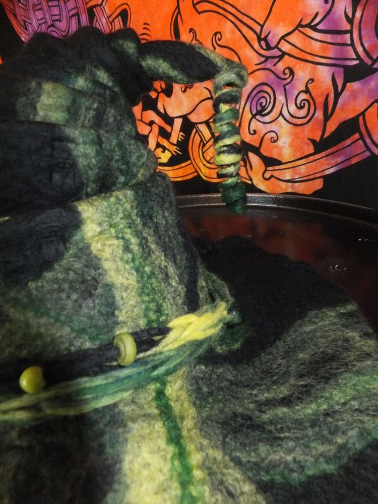

Weil der neue Hut so toll ist und so viel Spaß gemacht hat, hab ich mich
gleich auch noch am dritten Tag dem Filzen gewidmet. Hier sind ein paar
Fotos vom Entstehungsprozess.  

Ich habe beim letzten Hut auf Perlenzierde verzichtet, aber diesmal
dürfen sie mein Hutband verschönern, das aus einem sehr dünnen gefilzten
Band besteht, welches ich nach dem Filzen mit den Fingern gehäkelt habe,
jetzt hab ich die Falten gelegt und das Schätzchen trocknet nun. Ich hab
mich für noch mehr Zwirbel entschieden, also hat dieser Hut nun nicht
nur am Zipfel ein Löckchen sondern auch zwei als Abschluss des
Hutbandes. Sie trocken um die Bleistifte gewickelt, die Wäscheklammern
an den Hutfalten hab ich noch zur Sicherheit hinzugefügt, halten würde
es auch so. Nachdem der Hut getrocknet ist, werden auch die Farben noch
leuchtender hervorkommen. Morgen werden wir das fertige Ergebnis
sehen...  ;)

Und es ist eine Nacht vergangen, der Hut ist trocken, wurde von den
Bleistiften und Wäscheklammern befreit und hier ist das Ergebnis.

