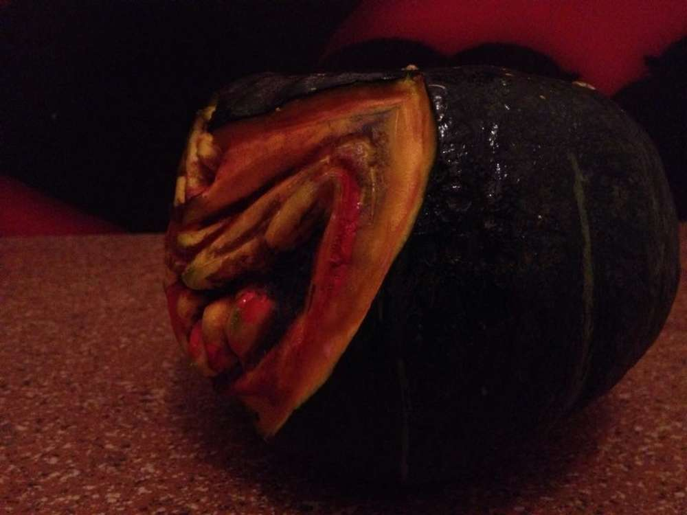

Bald ist Halloween und wann wenn nicht jetzt ist es an der Zeit ein Tutorial zum Kürbisschnitzen zu machen? Du brauchst dazu einen Kürbis und Schnitzwerkzeuge und zum Schluss einen Tuschkasten und einen feinen Pinsel.

Unser Kürbis soll ein kleines freches Grinsen mit einem Zyklopenauge bekommen. Hierfür höhlen wir den Kürbis nicht aus, als Vorbereitung soll lediglich das Abtragen der grünen Schale dienen. Anhand der Form kann man schon die Lage des Auges erahnen und wie breit das Grinsen des Kürbis wird. Mit einer Nadel o.ä. kann man sich anritzen, wo die wichtigsten Teile des Gesichtes liegen sollen, das hilft einem bei den ersten Schnitten mit dem Messer.

Mit einer Nadel o.ä. kann man sich anritzen, wo die wichtigsten Teile des Gesichtes liegen sollen, das hilft einem bei den ersten Schnitten mit dem Messer. Beginnt nun mit den Details, erstmal schnitzt ihr im Groben zum Beispiel die Zähne und das Auge, sucht erstmal die Formen eures Gesichtes.

Wenn ihr die Formen gefunden habt, geht es an das Ausdefinieren. Die Zähne müssen runder und die Mundwinkel tiefer, das Auge muss noch sein Lid bekommen und etwas tiefer liegen, auch die Falten um die Mundwinkel verdienen nun eure Aufmerksamkeit, wenn euch die Formen und Falten gefallen, geht es nun an das Finishing.  

Tusche her und Pinsel schwingen. Achtet bei bemalen darauf, dass eure Tusche nicht zu wässrig ist und macht dunkel, was im Schatten liegt und setzt Akzente erst zum Schluss, so wie hier das Blut auf den Zähnen oder die Adern im Auge. Um dem Kürbis ein wenig Haltbarkeit zu geben (mit intakter Schale halten Kürbisse sich über Monate...) haben wir mit Klarlack eine unsichtbare Schutzschicht nach dem Trocknen der Tusche aufgetragen.

Nach insgesamt 4 Stunden Arbeit und dem Verzehr eines halben Schokokuchens sind wir mit dem Ergebnis sehr zufrieden, jetzt braucht unser Zyklopschen noch einen Namen, hat jemand vielleicht eine tolle Idee? (Vorschläge dürfen gerne als Kommi gepostet werden!)
