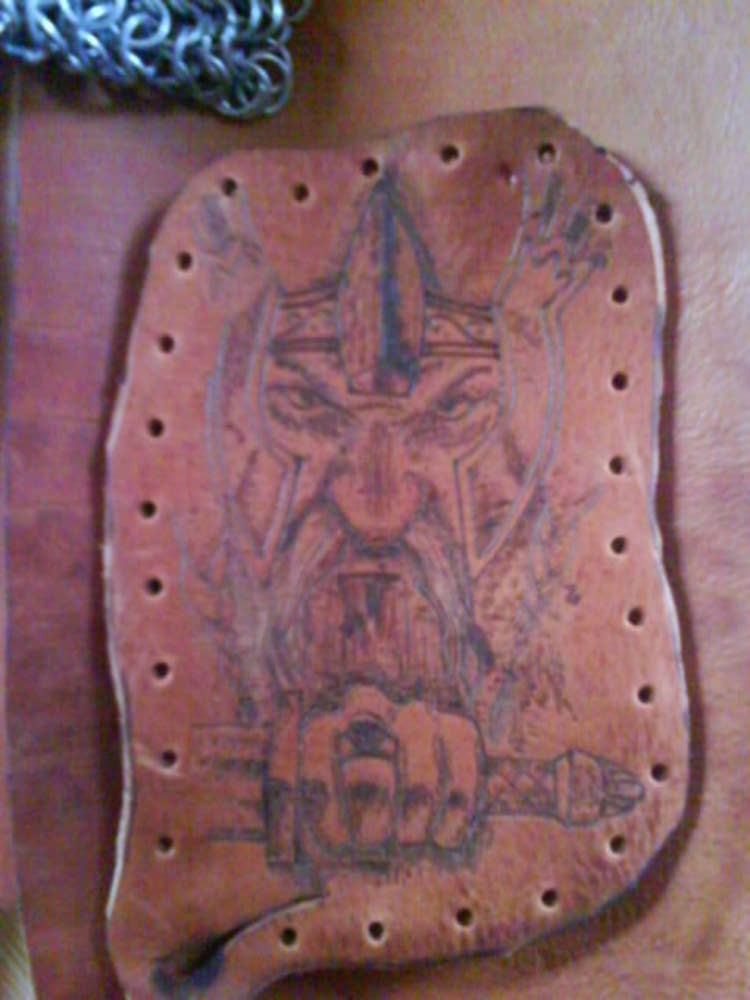
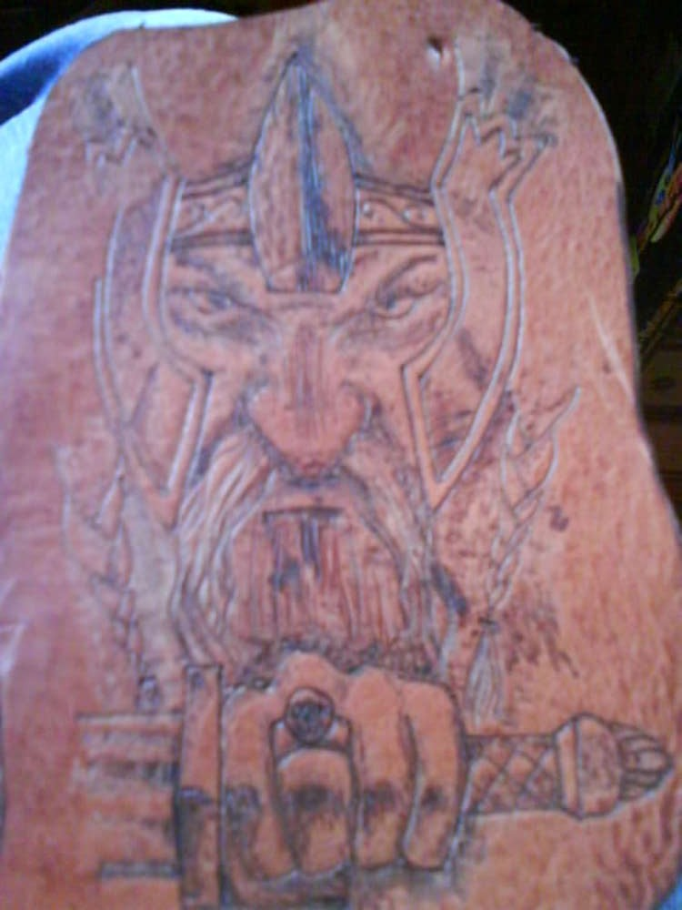

Nachdem ich festgestellt hatte was man mit Vaddis Lötkolben alles
anstellen kann, hab ich mich an das erste Lederbranding rangewagt, man
was braucht man da Feingefühl. Ist natürlich auch nicht so detailliert
wie auf der Vorlage aber trotzdem ganz ok. Blöd nur, wenn man noch nicht
so richtig auf der Schippe hat, dass ein Lötkolben heiß ist...  
